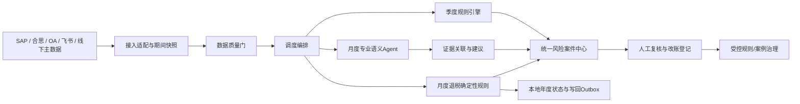
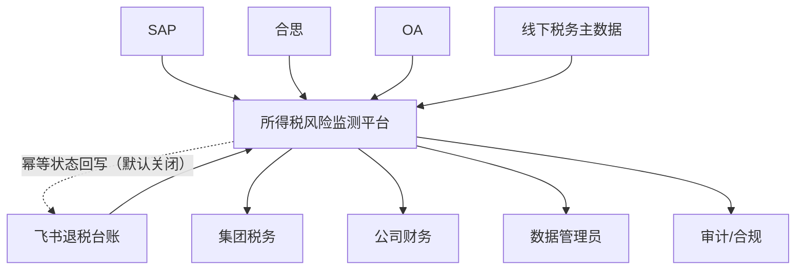

# 1 架构设计说明书

## 1.1 产品版本&密级

- 产品版本：V0.1。
- 文档版本：V1.0。
- 文档密级：集团内部。
- 上游文档：[集团所得税风险监测平台总设计](../../superpowers/specs/2026-07-12-group-income-tax-risk-monitoring-platform-design.md)。

## 1.2 拟制信息

- 拟制日期：2026-07-12。
- 拟制方式：用户确认业务口径、Codex设计、独立Agent审视。

## 1.3 修订记录

| 版本 | 日期 | 内容 |
|---|---|---|
| V0.1 | 2026-07-12 | 架构设计初版 |
| V0.2 | 2026-07-12 | 修正潜在调增为“暂估余额 + 合思无票报销”并明确SAP收到分红口径 |
| V0.3 | 2026-07-12 | 补齐风险指纹、接口Schema、精度与舍入约束 |
| V0.4 | 2026-07-12 | 与总设计独立评审修订保持一致 |
| V0.5 | 2026-07-12 | 与总设计第二轮评审修订保持一致 |
| V0.6 | 2026-07-12 | 第三轮独立规格评审通过 |
| V0.7 | 2026-07-12 | 增加未关联SAP的OA/合思业务招待费独立判断与案件合并路径 |
| V0.8 | 2026-07-12 | 未关联业务单据双路径修订通过独立规格评审 |
| V0.9 | 2026-07-16 | 增加递延所得税计提/转回准确性季度能力及版本兼容设计 |
| V1.0 | 2026-07-17 | 增加所得税退税进度监控及入账科目准确性检查和外部写回边界 |

## 1.4 关键词

所得税、风险监测、Agent、规则引擎、SAP、合思、OA、可审计、人机协同。

## 1.5 摘要

平台采用“确定性规则引擎 + 专业语义Agent + 人工复核”的混合架构，形成季度四项确定性监测、月度纳税调增科目准确性监测和所得税退税进度监控及入账科目准确性检查六项核心能力。季度税务计算和退税金额/科目匹配完全确定性运行；月度Agent只理解业务文本、关联证据并提出改账方向。所有结果绑定数据快照、主数据、规则、模型及人工操作版本，适配100家以上公司的并行监测。

## 1.6 缩略语清单

| 缩略语 | 英文全称 | 中文名 |
|---|---|---|
| ERP | Enterprise Resource Planning | 企业资源计划系统 |
| SAP | Systems, Applications and Products | SAP企业管理系统 |
| OA | Office Automation | 办公自动化系统 |
| LLM | Large Language Model | 大语言模型 |
| RBAC | Role-Based Access Control | 基于角色的访问控制 |
| RLS | Row-Level Security | 行级安全 |
| DFX | Design for X | 面向质量属性的设计 |
| FMEA | Failure Mode and Effects Analysis | 失效模式与影响分析 |

## 1.7 前言

本说明书描述首期平台架构、组件边界、逻辑/实现/部署/运行模型及安全可靠性设计，不替代具体源系统接口字段清单和实施计划。

# 2 简介

## 2.1 目的

定义能够稳定承载季度公式监测、月度语义监测、月度退税确定性监测和人工复核闭环的整体架构，使各组件可独立理解、测试、扩展和审计。

## 2.2 范围

覆盖SAP、合思、OA、飞书退税台账及线下税务主数据接入，季度四项监测，月度三类科目组成的一项科目准确性监测，以及每年3-12月的所得税退税进度监控及入账科目准确性检查，风险案件、驾驶舱、权限、安全、审计和版本治理。自动改账、自动申报、税率判断和全量汇算项目不在首期范围。

## 2.3 文档结构

文档按概念模型、质量目标、原则、用例、关键方案、逻辑架构、实现架构、安全可靠性和服务化能力展开。

## 2.4 利益相关人

| 角色 | 关注点 |
|---|---|
| 集团税务 | 全集团风险、规则口径、最终复核、审计证据 |
| 公司财务 | 本公司风险、改账建议和处理时效 |
| 数据管理员 | 数据接入、主数据、控制总额和失败恢复 |
| 内审/合规 | 版本、证据、操作轨迹和权限 |
| IT建设团队 | 接口、数据模型、服务边界、性能和安全 |

## 2.5 对已有架构的借鉴与反思

工作区无既有系统或架构可继承。设计借鉴企业数据平台的分层、不可变快照和事件留痕模式，同时避免让单一大模型同时承担计算、判断、执行和审计职责。

# 3 概念模型

核心概念为公司、会计期间、退税所属年、数据快照、税务主数据、监测批次、规则/模型版本、退税年度目标、写回 outbox、风险案件、证据和人工复核动作。

# 4 架构和关键质量属性目标

## 4.1 架构目标

- 覆盖100家以上公司，按公司×期间隔离运行。
- 数值计算可重复，语义判断可解释，人工结论可追溯。
- 单家公司或单一来源失败不影响整批。
- 规则、模型和主数据更新可审核、回放和回滚。

## 4.2 关键架构需求

1. 确定性公式与标准底稿一致率100%。
2. 结果到原始数据、主数据和版本的可追溯率100%。
3. 主数据缺失或重复拦截率100%。
4. 100+公司季度批次成功率不低于98%，失败公司可单独重跑。
5. 数据就绪后月度结果T+2内生成。

## 4.3 假设和约束

- 集团使用统一财务系统、会计科目和核算规则。
- 税率、亏损和前三完整年度平均税负率来自线下受控表。
- 递延所得税税率作为独立公司主数据维护，不默认等同于适用税率。
- SAP、合思和OA能够提供最低必要字段及稳定来源主键。
- 退税扫描年固定为退税所属年下一年，仅在3-12月运行；具体月度运行日由外部调度配置。
- 退税金额按公司币种和 amount scale 使用`ROUND_HALF_UP`后单条完全等额匹配。
- Agent只能通过白名单接口读取授权数据。

### 4.3.1 生命周期约束

数据、规则、模型和风险记录的保留、归档与销毁遵循集团财税档案和数据安全制度；平台不得在记录仍受财税留存义务约束时自动删除。

# 5 架构原则

1. 数字交给规则，语义交给Agent，最终判断交给人。
2. 缺数不等于零，数据异常不等于无风险。
3. 原始数据不可改写，标准化和计算均保留版本。
4. 最小权限、最小数据、职责分离。
5. 先证据后结论；模糊关联不得冒充精确关联。
6. 组件接口稳定，内部实现可替换。

# 6 系统用例模型

## 6.1 上下文模型

平台位于集团财务/税务管理域，对外只读取得SAP、合思、OA业务数据和退税台账，接收线下主数据；仅在退税唯一到账且运行门禁启用时，通过受限 outbox 投递器向飞书多维表回写状态。对内向财务、税务、数据管理员和审计角色提供受控界面。

### 6.1.1 上下文图

### 6.1.2 外部接口描述

| 接口 | 方向 | 模式 | 关键契约 |
|---|---|---|---|
| SAP数据 | 入站 | API/数据视图/批量文件适配器 | 公司、期间、源主键、记录数、金额总额、币种、累计递延所得税费用；退税另需凭证行ID、借贷、冲销、科目、凭证号、行项目、过账日 |
| 合思数据 | 入站 | API/批量文件适配器 | 报销单号、公司、期间、金额、事由、关联号 |
| OA数据 | 入站 | API/批量文件适配器 | 申请单号、公司、日期、事由、对象、参与人 |
| 飞书退税台账 | 入站/受限出站 | 原生Sheet读取、outbox幂等回写 | 公司、退税所属年、应退金额、到账状态；普通xlsx只读且禁止回写 |
| 税务主数据 | 入站 | 受控Excel | 公司唯一、有效期、上传/复核人、文件校验值 |
| 风险导出 | 出站 | 受权限控制的Excel | 导出字段、操作者、时间、条件、日志 |

## 6.2 关键系统用例模型

### 6.2.1 需求编号：TAX-MON-001 季度批量监测

#### 6.2.1.1 关键系统用例

集团税务创建或由调度器自动创建季度批次；平台校验数据，按规则版本运行三项或四项公式，生成异常公司和公式展开。新规则版本增加递延所得税检查，历史规则版本仍按原三项顺序回放。

#### 6.2.1.2 交互场景

数据齐全时按公司并行计算；缺数公司进入待补数；失败公司独立重跑；结果进入风险案件中心。

### 6.2.2 需求编号：TAX-MON-002 月度科目监测

#### 6.2.2.1 关键系统用例

平台按规则确定公司范围，提取本年累计明细，专业Agent宽筛、深判并输出风险和改账建议。

#### 6.2.2.2 交互场景

公司财务确认、驳回或补材料；改账后登记更正凭证；集团税务复核关闭；结论进入待审案例池。

### 6.2.3 需求编号：TAX-MON-003 所得税退税进度监控及入账科目准确性检查

#### 6.2.3.1 关键系统用例

每年3-12月由幂等 API 或外部调度创建扫描任务。平台以退税所属年 N 的应退公司和金额为目标，扫描 N+1 年截至当月的 SAP 单条贷方未冲销凭证行；金额按公司币种/scale和`ROUND_HALF_UP`量化后完全等额匹配。

#### 6.2.3.2 交互场景

第一阶段先匹配所得税费用和其他收益，只有零命中时才以应交税费作为第二阶段候选。无候选时保持未到账并次月继续；唯一所得税费用候选确认正确到账；唯一其他收益或第二阶段唯一应交税费候选确认到账并产生`REFUND_BOOKED_TO_WRONG_ACCOUNT`案件；选中阶段内多候选进入歧义且不自动选取。正确或错误的唯一到账均先提交本地年度`RECEIVED`状态和 outbox，再异步回写飞书“已退税”；飞书已手工标记“已退税”时，导入本地状态后直接停止扫描且不重复回写。

# 7 关键技术方案设计

## 7.1 确定性计算与可追溯方案

公式、阈值、SAP科目范围、金额符号和有效期存放在版本化规则配置中。计算使用十进制定点金额。每次结果保存公式版本、代入值、来源字段、快照编号和计算时间。递延所得税按`（可弥补以前年度亏损 - 损益表累计利润总额）× 递延所得税税率 - SAP累计已计提递延所得税费用`计算本年应计提/转回额，不对基础取零；舍入后非0示警，正数计提、负数转回。SAP累计额使用科目余额表 `1811030000` 的期末余额原值。

SAP累计已计提递延所得税费用按科目余额表 `1811030000`（递延所得税资产-可抵扣亏损）的期末余额原值取数，不做符号翻转；科目余额表查询成功但目标科目缺失时视为未计提并取0。接口失败、响应不合法或未导入时保持缺数据并阻断本项检查。

退税检查同样由版本化确定性规则执行。第一阶段0个等额候选时才检查第二阶段；最终0个候选为`NOT_RECEIVED`，唯一所得税费用候选为`RECEIVED+CORRECT`，唯一其他收益或唯一应交税费候选为`RECEIVED+WRONG_ACCOUNT`，选中阶段多个候选为`AMBIGUOUS`。其他收益和应交税费唯一命中均示警；下月跳过以平台数据库中公司+退税所属年的本地`RECEIVED`为准，飞书手工状态会在扫描前同步为该本地状态。

飞书来源已切换为多维表：季度主数据读取所得税税率、递延所得税税率、可弥补亏损额合计和3年平均税负率，并只处理公司代码非空且唯一的记录；退税状态可原子回写并可作为手工到账输入。汇算清缴相关科目明细已确认三项其他收益科目、三项所得税费用科目、`2221130000`应交税费-企业所得税及逐条 `-KSL` 口径；同为`2221`前缀的其他税费科目不属于退税候选。但当前接口仍缺行项目唯一标识、过账日期和冲销标志，取得完整SAP凭证行合同及精度验收前，退税SAP外部拉取保持关闭。

## 7.2 AI架构技术方案

- 按业务域拆分招待费、福利费和公益捐赠Agent。
- 关键词/同义词/排除词进行高召回宽筛，语义Agent进行证据约束的深判。
- 证据Agent只通过白名单接口读取必要字段，输出引用片段和关联等级。
- 建议Agent输出标准候选科目；证据不足时输出“待补材料”。
- 业务招待费支持双路径：已关联时以SAP凭证行为主；未关联时以OA申请或合思报销为主记录独立判断，并标记SAP待定位。未关联业务单据不得冒充某张SAP凭证的证据。
- 模型不得计算税额、改写主数据、生成SQL遍历全库或自动过账。

# 8 逻辑架构

## 8.1 结构模型

### 8.1.1 架构模式

采用分层架构、端口适配器模式、任务编排和案件工作流。规则引擎与语义Agent是并列能力，共享数据快照和证据服务，通过风险案件接口汇合。

### 8.1.2 1层-n层逻辑模型

1. 展示层：驾驶舱、风险列表、详情和管理界面。
2. 业务层：批次、案件、复核、规则发布。
3. 智能/规则层：公式、范围筛选、语义Agent和证据服务。
4. 数据层：原始、标准、主题、快照和审计数据。
5. 接入层：SAP、合思、OA、Excel适配器。

### 8.1.3 逻辑接口设计

| 接口 | 提供方 | 消费方 | 语义 |
|---|---|---|---|
| SnapshotReady | 数据质量服务 | 编排器 | 指定公司/期间可运行 |
| CalculateQuarterly | 规则服务 | 编排器 | 按规则版本返回三项或四项公式结果和代入明细 |
| ClassifyExpense | 语义Agent | 编排器 | 返回标准分类、证据、候选科目 |
| EvaluateIncomeTaxRefund | 退税规则服务 | 编排器 | 返回到账/科目状态、匹配证据、继续扫描和回写标志 |
| DeliverRefundWriteback | Outbox投递器 | 飞书原生Sheet | 按公司、退税所属年和目标状态幂等回写 |
| CreateOrUpdateRisk | 案件服务 | 规则/Agent | 幂等创建或追加检测记录 |
| RecordReview | 复核服务 | 用户界面 | 保存结论、理由、附件和更正凭证 |

## 8.2 行为模型

### 8.2.1 用例设计1：季度批次

`待取数 → 校验中 → 待补数/可运行 → 运行中 → 已生成/运行失败`。任何数据异常只影响对应公司和监测类型。

### 8.2.2 用例设计2：月度风险案件

`新发现 → 待分派 → 待公司确认`，随后进入确认风险、入账合理或信息不足分支。集团税务拥有最终关闭权。

### 8.2.3 用例设计3：月度退税扫描

`待扫描 → 未到账/已到账/歧义`。未到账和歧义次月继续；唯一到账先写本地年度主事实，再进入`待回写 → 已回写/重试中`。写回状态不得改变检测结论，错误科目案件独立进入人工处理流程。

## 8.3 数据模型

### 8.3.1 架构模式

采用不可变来源事实、标准化主题数据、事件化检测记录和可变案件状态分离的模式。

### 8.3.2 关键数据设计

核心实体为Company、TaxMasterData、AccountingSnapshot、VoucherLine、BusinessDocument、EvidenceLink、RuleVersion、ModelVersion、MonitoringBatch、IncomeTaxRefundTarget、RefundWritebackOutbox、RiskCase、DetectionRecord、EvidenceTask、SapLinkCoverage和ReviewAction。RiskCase允许SAP凭证行或未关联的OA/合思业务单据作为主记录，并记录SAP关联状态与案件合并关系；无法关联前置单据的SAP凭证进入SapLinkCoverage，不借用同公司其他业务单据。

### 8.3.3 静态数据结构模型

TaxMasterData按公司和有效期唯一，并分别维护适用税率与递延所得税税率；AccountingSnapshot按公司、期间和来源批次唯一；IncomeTaxRefundTarget按公司和退税所属年唯一，平台数据库状态是主事实；RiskCase按主记录类型使用稳定案件指纹；DetectionRecord保存每次规则/模型版本结果。未关联业务单据后续找到SAP凭证时，保留原案件历史并合并到SAP主案件。

### 8.3.4 数据所有权模型

- SAP/合思/OA来源系统拥有原始事实。
- 集团税务拥有税务主数据、规则和最终风险结论。
- 公司财务拥有本公司复核说明和更正凭证登记。
- IT数据团队负责传输、质量和平台元数据，不决定税务结论。

## 8.4 逻辑元素清单

接入适配器、快照服务、数据质量服务、任务编排器、季度规则引擎、退税规则引擎、退税年度状态仓储、outbox投递器、三类语义Agent、证据服务、建议服务、案件服务、工作流服务、权限服务、审计服务、驾驶舱和管理台。

# 9 实现架构

## 9.1 实现元素模型

### 9.1.1 模型设计

每个逻辑元素实现为独立模块或服务，按稳定接口通信。首期可同一部署单元模块化实现，但不得跨模块直接访问内部表。

### 9.1.2 实现元素清单

- connectors、snapshot、data-quality、orchestrator、rule-engine。
- refund-ledger、sap-refund-voucher、refund-rule、refund-outbox。
- agent-entertainment、agent-welfare、agent-donation、evidence、recommendation。
- risk-case、workflow、rbac、audit、dashboard、admin。

### 9.1.3 实现元素规格视图输出策略

每个元素维护接口契约、错误码、权限、输入输出schema、SLO、测试与版本说明；详细实现见详细设计说明书。

## 9.2 技术模型

### 9.2.1 运行框架

采用支持定时任务、队列、重试、幂等和结构化日志的企业运行框架。具体技术栈在实施计划中选择，不改变本架构边界。

### 9.2.2 通信框架

同步查询使用受鉴权API；批量处理通过任务队列和状态事件解耦；大文件进入对象存储后传递受控引用。

### 9.2.3 OM框架

OM指运行管理。平台提供任务状态、失败原因、重试、数据就绪率、Agent调用量、延迟、错误率和审计查询。

### 9.2.4 其他实现元素技术模型

语义检索索引必须支持公司/组织权限过滤；模型调用通过企业网关统一鉴权、限流、脱敏和留痕。

### 9.2.5 接口实现机制清单

REST/企业API、批量文件、数据视图、消息队列、对象存储引用和受控Excel上传。

### 9.2.6 技术选型

不在架构阶段指定厂商。选型必须满足企业私有端点、零公共训练、结构化输出、RLS、审计、版本化和可回放要求。

### 9.2.7 开源策略

可使用经集团安全审核的开源基础组件；税务规则、提示词、案例和业务数据不得公开。

## 9.3 数据模型

### 9.3.1 架构模式

关系型数据库保存主数据、批次、案件和审计；对象存储保存来源文件和附件；分析存储支持集团聚合；语义索引只保存最小必要文本及权限标签。

### 9.3.2 关键数据机制设计

快照不可变、主数据有有效期、案件和检测记录分离、跨系统证据带关联等级、所有写操作附操作者和版本。

## 9.4 代码模型

### 9.4.1 模型设计

按领域模块组织代码，禁止UI、Agent或适配器绕过领域服务直写案件、规则和审计表。

### 9.4.2 代码元素清单

具体代码元素在实施计划中按上述模块拆解；本阶段不指定语言和文件结构。

## 9.5 构建模型

### 9.5.1 模型设计

构建流水线执行单元测试、公式回放、schema兼容、安全扫描和制品签名；规则/模型版本与应用制品可独立发布但受统一审批。

### 9.5.2 构建元素清单

应用制品、规则包、提示词包、案例库版本、数据库迁移、接口schema和测试报告。

### 9.5.3 硬件模型

不涉及专用硬件。部署资源按数据量、并发批次和模型调用量弹性配置。

## 9.6 交付模型

### 9.6.1 模型设计

按五阶段交付，生产发布需携带应用、规则、模型/提示词、迁移、回放报告和回滚方案。

### 9.6.2 交付元素清单

应用包、接口适配器、规则配置、权限配置、数据字典、测试报告、运维手册、用户手册和培训材料。

### 9.6.3 软件包命名格式

`tax-risk-<component>-<semantic-version>-<build-id>`；规则和模型包使用独立版本号。

## 9.7 部署模型

### 9.7.1 部署节点及规格定义

逻辑节点包括入口网关、应用/工作流、批处理Worker、规则服务、Agent网关、关系数据库、对象存储、分析存储、语义索引和监控审计。实际规格在容量测试后确定。

### 9.7.2 模型设计

按集团安全域内部署；模型为企业受控端点。生产、测试和开发环境隔离，业务数据不得直接复制到非生产环境。

## 9.8 运行模型

### 9.8.1 并发、并行设计

按公司并行，单公司内依赖串行；全局控制Agent并发、队列长度和源系统限流。失败使用有限退避重试，超过上限进入异常队列。

### 9.8.2 运行交互分析

#### 9.8.2.1 用例设计1：季度运行

源数据就绪后生成快照，质量门通过才计算；递延所得税检查要求有效递延所得税税率和SAP累计已计提递延所得税费用，缺任一项即阻断对应公司本次`QUARTERLY_V3`执行且不得补0，也不允许部分写入其他检测结果。结果幂等写入检测记录并创建/更新案件。`QUARTERLY_V2`仅用于按原加法公式重放历史运行。

#### 9.8.2.2 用例设计2：月度运行

范围筛选后宽筛候选，证据服务批量关联，专业Agent深判，建议服务结构化输出。业务招待费无法关联SAP时，OA/合思业务单据作为独立主记录继续判断；证据不足而非单纯未关联时才进入人工待补材料。

#### 9.8.2.3 用例设计3：所得税退税运行

幂等 API 或外部调度在3-12月触发；由于具体运行日未确认，系统不内置固定日期。编排器冻结退税所属年 N 的目标和扫描年 N+1 的 SAP 凭证行，逐公司执行单条等额规则。唯一到账的本地状态、检测、可选错误科目案件和 outbox 原子提交；已`RECEIVED`公司后续月份跳过。投递器独立重试飞书回写，远端失败不回滚主事务。

# 10 基于架构的安全/韧性/隐私/可靠/可用/功能安全等属性分析

## 10.1 安全/韧性威胁分析

### 10.1.1 价值资产清单/列表

财务凭证、报销和OA明细、税务主数据、风险结论、规则/提示词/案例库、用户身份和审计日志。

### 10.1.2 暴露面清单/列表

源系统接口、文件上传、用户登录、查询/导出、管理配置、Agent工具接口、模型端点和运维接口。

### 10.1.3 攻击路径模型

#### 10.1.3.1 财税数据攻击路径

越权用户或恶意输入试图通过查询、导出、附件或提示注入获取其他公司数据，或诱导Agent绕过规则。

#### 10.1.3.2 架构元素分类列表

- 高敏：财务/人员明细、税务主数据、风险结论。
- 受控：规则、提示词、案例库、审计日志。
- 一般：脱敏聚合指标和公开法规引用。

### 10.1.4 韧性控制点清单/列表

身份鉴别、RBAC/RLS、公司权限标签、模型网关、输入隔离、白名单工具、导出审批、审计、防篡改快照、备份恢复和限流熔断。

### 10.1.5 安全韧性威胁模型

重点威胁为越权、敏感数据泄露、提示注入、规则篡改、来源数据污染、重复/重放、模型供应链变化和审计日志缺失。

### 10.1.6 安全韧性逻辑模型

网关鉴权 → 组织/公司授权 → 数据行过滤 → 工具白名单 → 输出脱敏 → 操作审计；任何层失败均拒绝访问而非放宽权限。

## 10.2 安全模型

### 10.2.1 0~n层安全设计框架

#### 10.2.1.1 初始化过程安全

首次配置由数据管理员上传、税务管理员复核；接口密钥进入密钥管理系统；默认拒绝所有公司数据权限。

#### 10.2.1.2 运行安全域

开发、测试、生产隔离；应用、数据和模型访问分域；生产数据只在授权域处理。

#### 10.2.1.3 防绕过

权限在API和数据库双层执行；UI隐藏不作为安全控制；Agent无法绕过工具网关。

#### 10.2.1.4 自保护

制品签名、配置校验、异常告警、审计日志防篡改、依赖扫描和版本回滚。

### 10.2.2 1~n层子系统安全模型

接入层验证来源和schema；数据层强制RLS；规则层审批发布；Agent层最小数据和结构化输出；展示层防越权和导出审计。

## 10.3 安全/韧性部署模型

所有组件部署在集团批准的安全域；外部模型仅通过企业网关访问，使用零公共训练/符合集团要求的留存策略；网络、密钥和日志按环境隔离。

## 10.4 可靠性与可用性属性分析模型

数据质量门阻断错误计算；任务幂等、失败隔离、退避重试和异常队列保证批处理恢复；退税写回采用本地年度主事实和 outbox，隔离外部 Sheet 不可用；备份、恢复演练和规则/模型回滚降低变更风险。

## 10.5 公共组件安全配置分析

数据库、对象存储、消息队列、模型网关、日志和监控使用集团安全基线；关闭匿名访问、默认账户和不必要端口，启用传输/静态加密和密钥轮换。

# 11 组件化或服务化架构6独立能力

| 独立能力 | 设计说明 |
|---|---|
| 可独立开发 | 接口先行，各模块不依赖内部实现 |
| 可独立测试 | 公式、Agent、数据质量和案件均有独立契约测试 |
| 可独立构建 | 应用、规则、提示词/案例库形成独立制品 |
| 可独立部署 | 首期可合并部署，但保持可拆分边界 |
| 可独立升级 | 版本兼容、历史回放和回滚 |
| 可独立运维 | 独立指标、日志、告警和责任人 |

# 12 其他说明

平台输出是内部管理监测结果，不替代最终会计判断、纳税申报或税务机关结论。福利费和公益性捐赠仅对累计限额已超公司进行科目检查，是首期明确范围边界。

# 13 参考资料清单

1. [集团所得税风险监测平台总设计](../../superpowers/specs/2026-07-12-group-income-tax-risk-monitoring-platform-design.md)
2. [中华人民共和国企业所得税法实施条例](https://www.chinatax.gov.cn/n810341/n810765/n812176/n812748/c1193046/content.html)
3. [中华人民共和国企业所得税法](https://12366.chinatax.gov.cn/bzds/024/024-5-1.html)
4. [企业所得税税前扣除凭证管理办法](https://fgk.chinatax.gov.cn/zcfgk/c100012/c5194804/content.html)
