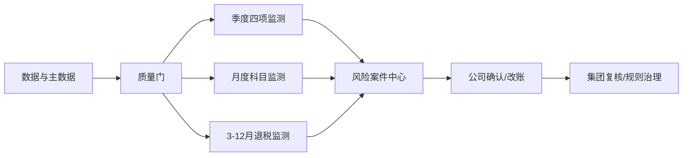

# 1 功能设计说明书

## 1.1 产品版本&密级

- 产品版本：V0.1。
- 文档版本：V1.1。
- 文档密级：集团内部。

## 1.2 拟制信息

- 拟制日期：2026-07-12。
- 上游文档：[总设计](../../superpowers/specs/2026-07-12-group-income-tax-risk-monitoring-platform-design.md)、[架构设计](../architecture/2026-07-12-group-income-tax-risk-monitoring-platform-architecture.md)。

## 1.3 修订记录

| 版本 | 日期 | 内容 |
|---|---|---|
| V0.1 | 2026-07-12 | 功能设计初版 |
| V0.3 | 2026-07-12 | 补齐正式风险建案条件、精确关联与数据字段要求 |
| V0.4 | 2026-07-12 | 与总设计独立评审修订保持一致 |
| V0.5 | 2026-07-12 | 统一IngestBatch接口契约 |
| V0.6 | 2026-07-12 | 第三轮独立规格评审通过 |
| V0.7 | 2026-07-12 | 增加业务招待费未关联SAP时以OA/合思主记录直接判断的路径 |
| V0.8 | 2026-07-12 | 未关联业务单据双路径修订通过独立规格评审 |
| V0.9 | 2026-07-14 | 明确累计营业收入小于或等于0时本年累计所得税税负率取0 |
| V1.0 | 2026-07-16 | 增加递延所得税计提/转回准确性季度检查及展示输出 |
| V1.1 | 2026-07-17 | 增加所得税退税进度监控及入账科目准确性检查及外部接口启用边界 |

## 1.4 关键词

季度计提、递延所得税、税负率、潜在调增、所得税退税、业务招待费、福利费、公益性捐赠、风险案件、Agent。

## 1.5 摘要

本文定义集团所得税风险监测平台的六项核心能力，即季度四项确定性监测、月度纳税调增科目准确性监测和所得税退税进度监控及入账科目准确性检查，并给出数据质量门、人工处置、驾驶舱、输入、输出、规则、接口、异常及验收要求。

## 1.6 缩略语清单

| 缩略语 | 英文全称 | 中文名 |
|---|---|---|
| SAP | Systems, Applications and Products | SAP企业管理系统 |
| OA | Office Automation | 办公自动化系统 |
| Agent | Intelligent Agent | 智能代理 |
| DFX | Design for X | 面向质量属性的设计 |
| FMEA | Failure Mode and Effects Analysis | 失效模式与影响分析 |

## 1.7 前言

功能设计以用户已确认口径为唯一业务基线。规则结果属于内部监测，不替代最终会计和税务结论。

# 2 功能域：集团所得税风险监测

## 2.1 功能域概述

### 2.1.1 功能域总述

本功能域面向集团税务、公司财务、数据管理员和审计人员，把汇算清缴问题前移到月度/季度。核心能力为数据就绪校验、季度确定性计算、月度高召回语义识别、月度退税确定性核对、风险案件处置、集团汇总和全链路追溯。



边界：不自动过账、不自动判断税率/亏损、不自动申报、不让Agent直接算税或自动学习。

## 2.2 功能域总体方案

平台按公司×期间建立批次和不可变快照。数据质量门通过后，季度规则引擎、月度专业Agent和月度退税确定性规则分别运行并汇入统一风险案件中心；风险由公司处理、集团复核。所有输出附数据、公式、规则和模型版本。

## 2.3 功能域规格设计

| 编号 | 规格 |
|---|---|
| FD-001 | 支持100家以上公司按组织树分层管理和批量运行 |
| FD-002 | 四项季度公式结果与标准底稿一致率100% |
| FD-003 | 月度三类科目输出疑似错入、证据、置信度和改账建议 |
| FD-004 | 每年3-12月输出退税到账进度和入账科目，唯一错误科目命中须示警 |
| FD-005 | 缺数、重复、公司不匹配等数据异常不得显示为无风险 |
| FD-006 | 风险、数据、规则、模型和人工操作100%可追溯 |

# 3 功能项：数据准备与监测批次

## 3.1 功能概述

### 3.1.1 功能项总述

面向数据管理员和集团税务，将SAP、合思、OA和线下税务主数据转换为可运行的公司期间快照，并管理月度/季度批次。输入为来源批次及主数据文件，输出为可运行、待补数或失败状态。

## 3.2 实现思路

适配器落原始层，标准化公司、期间、币种、金额符号和源主键；使用记录数、金额控制总额、唯一性和有效期校验。任何关键校验失败只影响对应公司/监测类型。

SAP福利费和公益性捐赠明细必须包含会计期间、过账日期、凭证号、行项目、当前科目和金额。业务招待费优先通过SAP参考键、报销单号或申请单号关联SAP凭证行；无法精确关联时，OA业务招待申请和合思业务招待报销仍作为独立主记录进入语义判断，疑似错入可形成“SAP凭证待定位”的正式风险。

## 3.3 实现设计

### 3.3.1 数据质量与批次功能实现设计

- 税务主数据按公司和有效期唯一。
- 递延所得税税率作为独立公司主数据维护，不默认沿用适用税率。
- 业务招待费清单独立版本化。
- 每个来源记录保留原始主键和提取时间。
- 批次状态：`待取数→校验中→待补数/可运行→运行中→已生成/运行失败`。
- 同一快照和任务键重复提交幂等。

## 3.4 增量SR清单

| SR | 要求 |
|---|---|
| SR-DATA-001 | 主数据缺失或重复拦截率100% |
| SR-DATA-002 | 来源记录数和金额控制总额可查询 |
| SR-DATA-003 | 单家公司可独立补数和重跑 |

## 3.5 实现接口设计

### 3.5.1 实现接口设计

接入适配器统一返回批次元数据、schema版本、记录数、金额总额、源主键和错误码；快照服务向编排器发布就绪状态。

### 3.5.2 实现接口定义

```text
IngestBatch(batch_id, source, extraction_time, period,
            mode, schema_version, payload_ref,
            source_primary_key_definition,
            currency, amount_scale,
            record_count, control_total,
            idempotency_key)
  -> {status, accepted_rows, rejected_rows,
      row_errors[], retryable, ingest_batch_id}

ValidateSnapshot(company, period)
CreateMonitoringBatch(scope, period, monitor_types)
```

`mode`为FULL或INCREMENTAL；`status`为ACCEPTED、PARTIAL或REJECTED。每行携带按主键定义生成的源记录主键；PARTIAL返回逐行错误且默认不得进入可运行状态。

## 3.6 功能规格设计

- 公司无法匹配、税务主数据无有效版本、币种/符号不一致、控制总额不平时进入待补数。
- 数据异常与税务风险分开展示。
- 上传税务主数据须有上传人、复核人、文件校验值和生效期间。

## 3.7 DFX分析

### 3.7.1 可靠性分析

#### 3.7.1.1 FMEA分析

| 失效 | 影响 | 控制 |
|---|---|---|
| 源数据缺失 | 公式失真 | 阻断对应监测，不按0计算 |
| 重复导入 | 风险重复 | 幂等键和源主键唯一约束 |
| 错误主数据版本 | 税额系统性错误 | 有效期、双人复核、版本回放 |

### 3.7.2 可服务性分析

提供来源批次、校验项、错误记录、责任人、重试和控制总额页面。

### 3.7.3 安全设计检查

#### 3.7.3.1 安全设计确认

主数据上传和复核职责分离；文件和接口鉴权；原始数据只读不可改写。

#### 3.7.3.2 敏感操作检查

上传、复核、重跑、删除未发布批次和导出均记录审计日志。

### 3.7.4 可用性/性能分析

按公司并行，单公司失败隔离；数据就绪率和失败公司可从集团看板直接钻取。

## 3.8 影响点列表

SAP、合思、OA需提供稳定主键和控制总额；集团需维护税务主数据和公司清单。

## 3.9 分配需求

分配给接入适配器、快照服务、数据质量服务、编排器和主数据管理模块。

# 4 功能项：季度应计提所得税准确性检查

## 4.1 功能概述

### 4.1.1 功能项总述

面向集团税务和公司财务，对比系统应计提与SAP实际计提。输入为累计利润、SAP收到分红、公允价值变动、可弥补亏损、税率及SAP计提；输出为差异公司和完整公式展开。

## 4.2 实现思路

由确定性规则引擎按SAP账簿精度计算，不允许LLM参与。累计分红取SAP账上本年累计收到分红，排除向股东支付分红；SAP计提只取当期所得税。

## 4.3 实现设计

### 4.3.1 季度计提检查功能实现设计

```text
累计应纳税额
= max（累计利润总额 - SAP累计收到分红
- 累计公允价值变动损益 - 可弥补亏损, 0）× 税率

本季度应计提
= 累计应纳税额 - 以前季度SAP当期所得税计提

计提差异
= 本季度应计提 - 本季度SAP当期所得税计提
```

差异不等于0即示警；正数少计提，负数多计提/需冲回。本季度应计提允许为负。

## 4.4 增量SR清单

| SR | 要求 |
|---|---|
| SR-PROV-001 | 公式与标准底稿一致率100% |
| SR-PROV-002 | 差异不为0全部进入清单 |
| SR-PROV-003 | 每个代入值可追溯到来源字段和版本 |

## 4.5 实现接口设计

### 4.5.1 实现接口设计

规则服务读取同一公司期间快照和有效税务主数据，返回结构化计算结果；案件服务幂等创建或更新风险。

### 4.5.2 实现接口定义

`CalculateProvision(company, quarter, snapshot_id, tax_master_version, rule_version)`返回代入值、累计税额、季度应提、SAP实际、差异和方向。

## 4.6 功能规格设计

输出公司、期间、累计利润、收到分红、公允价值、亏损、税率、累计应纳税额、以前季度计提、本季度应提、本季度实际、差异、方向和所有版本。

## 4.7 DFX分析

### 4.7.1 可靠性分析

#### 4.7.1.1 FMEA分析

科目范围混入递延所得税会系统性误算；通过SAP科目/凭证配置、抽样核对和标准案例阻断。

### 4.7.2 可服务性分析

风险详情显示公式、代入值、数据来源、精度和规则版本。

### 4.7.3 安全设计检查

#### 4.7.3.1 安全设计确认

计算只读访问授权公司快照；公式发布需税务管理员审批。

#### 4.7.3.2 敏感操作检查

规则发布、重跑、导出和关闭风险均审计。

### 4.7.4 可用性/性能分析

100+公司按公司并行；相同快照和规则重跑结果一致。

## 4.8 影响点列表

需建立SAP收到分红、当期所得税计提和公允价值变动的准确科目/字段映射。

## 4.9 分配需求

分配给规则引擎、季度计算Agent、案件服务和风险详情界面。

# 5 功能项：递延所得税计提/转回准确性检查

## 5.1 功能概述

### 5.1.1 功能项总述

面向集团税务和公司财务，每季度比较系统测算的累计递延所得税费用与 SAP 累计已计提的递延所得税费用。输出应计提或转回的公司清单、本年应计提/转回额、可弥补以前年度亏损、损益表累计利润总额、SAP 累计已计提额和递延所得税税率。

## 5.2 实现思路

规则引擎读取同一季度快照中的损益表累计利润总额、SAP 累计已计提递延所得税费用，以及按公司和有效期冻结的可弥补以前年度亏损、递延所得税税率。全程使用十进制定点金额，不允许 LLM 参与计算。

## 5.3 实现设计

### 5.3.1 递延所得税准确性检查功能实现设计

```text
递延所得税计税基础
= 可弥补以前年度亏损 - 损益表累计利润总额

系统累计递延所得税费用
= 递延所得税计税基础 × 递延所得税税率

本年应计提/转回的递延所得税费用
= 系统累计递延所得税费用 - SAP累计已计提的递延所得税费用
```

公式不对递延所得税计税基础取`max`或零下限；可弥补以前年度亏损按受控主数据中的非负余额参与计算，并减去损益表累计利润总额。系统累计递延所得税费用和本年调整额按公司账簿币种精度采用`ROUND_HALF_UP`舍入。

舍入后的本年应计提/转回额不为0即示警：正数生成“应计提”风险，负数生成“应转回”风险，0不建风险。SAP 累计已计提递延所得税费用按科目余额表 `1811030000` 的期末余额原值进入公式，不做符号翻转。

## 5.4 增量SR清单

| SR | 要求 |
|---|---|
| SR-DT-001 | 公式与标准底稿一致率100%，保留亏损加法语义且不取零 |
| SR-DT-002 | 舍入后本年应计提/转回额非0全部进入公司清单 |
| SR-DT-003 | 输出全部代入值、计提/转回方向、快照、主数据和规则版本 |
| SR-DT-004 | 科目余额表查询成功但未找到`1811030000`时 SAP 累计额取0；递延所得税税率缺失，或余额表接口失败、响应不合法、未导入时阻断该公司本次`QUARTERLY_V3`执行；`QUARTERLY_V2`仅保留历史加法公式重放 |

## 5.5 实现接口设计

### 5.5.1 实现接口设计

新规则版本在季度批次中增加递延所得税检测；历史规则版本仍按原三项监测重放，禁止因新增能力改变历史结果数量或顺序。

### 5.5.2 实现接口定义

`CalculateDeferredTax(company, quarter, cumulative_profit, loss_carryforward, deferred_tax_rate, sap_cumulative_deferred_tax_expense, snapshot_id, tax_master_version, rule_version)`返回系统累计递延所得税、本年调整额、示警代码、计提/转回方向和完整公式代入值。

## 5.6 功能规格设计

风险清单至少显示公司、SAP 累计已计提递延所得税费用、系统累计递延所得税费用、本年应计提/转回额、可弥补以前年度亏损、损益表累计利润总额和递延所得税税率；风险详情显示完整公式及来源血缘。监测频次为每季度。

## 5.7 DFX分析

### 5.7.1 可靠性分析

#### 5.7.1.1 FMEA分析

科目代码或期末余额口径错误会反转计提/转回结论；生产接入固定校验公司、年度和期间，只按代码 `1811030000` 取数且不从名称推断。合法响应中未找到目标科目时按未计提取0；接口失败、响应不合法或未导入仍阻断。

### 5.7.2 可服务性分析

风险详情显示计税基础、税率、系统累计额、SAP 累计额、本年调整额、方向、舍入模式及每个输入项来源。

### 5.7.3 安全设计检查

#### 5.7.3.1 安全设计确认

只读访问授权公司的季度快照和已复核主数据；规则及税率版本发布遵循双人复核。

#### 5.7.3.2 敏感操作检查

主数据变更、规则发布、SAP 映射变更、重跑、导出和风险关闭全部审计。

### 5.7.4 可用性/性能分析

复用季度公司级并行和不可变快照；新增纯函数计算不引入外部在线依赖。

## 5.8 影响点列表

税务主数据新增独立递延所得税税率；季度指标新增 SAP 累计已计提递延所得税费用，来源固定为科目余额表 `1811030000` 的期末余额原值。

## 5.9 分配需求

分配给税务主数据服务、SAP 适配器、快照质量门、季度规则引擎、案件服务和风险清单/公式详情界面。

# 6 功能项：当年累计税负率异常监测

## 6.1 功能概述

### 6.1.1 功能项总述

使用系统累计应纳税额与损益表累计营业收入计算本年税负率，并与线下表前三个完整年度平均税负率比较。

## 6.2 实现思路

复用计提检查的累计应纳税额，不重复计算历史平均。偏离阈值为绝对值达到5个百分点，不是相对变化5%。

## 6.3 实现设计

### 6.3.1 税负率监测功能实现设计

```text
本年累计税负率 = 累计营业收入 > 0时，本年累计应纳税额 / 累计营业收入；否则取0
偏离度 = 本年累计税负率 - 线下前三完整年度平均税负率
abs（偏离度） >= 0.05 → 示警
```

偏离为正标记偏高，为负标记偏低；恰好±5个百分点也示警。

## 6.4 增量SR清单

| SR | 要求 |
|---|---|
| SR-BURDEN-001 | 不重算线下历史平均税负率 |
| SR-BURDEN-002 | 收入≤0时本年累计税负率取0；历史数据缺失转数据异常 |
| SR-BURDEN-003 | 输出偏高/偏低和百分点差异 |

## 6.5 实现接口设计

### 6.5.1 实现接口设计

依赖季度计提结果和有效历史税负主数据；无有效依赖时返回数据异常。

### 6.5.2 实现接口定义

`CalculateTaxBurden(company, quarter, cumulative_tax, cumulative_revenue, historical_rate)`。

## 6.6 功能规格设计

输出公司、本年累计应纳税额、累计营业收入、本年累计税负率、历史平均税负率、偏离度和方向。

## 6.7 DFX分析

### 6.7.1 可靠性分析

#### 6.7.1.1 FMEA分析

累计营业收入为0或负数时不执行除法，本年累计税负率直接取0，并继续计算偏离度和示警方向。

### 6.7.2 可服务性分析

详情显示两项税负率来源及“5个百分点”阈值说明。

### 6.7.3 安全设计检查

#### 6.7.3.1 安全设计确认

按公司权限展示，聚合看板不泄露未授权公司明细。

#### 6.7.3.2 敏感操作检查

历史税负主数据上传和修改须双人复核。

### 6.7.4 可用性/性能分析

复用季度结果，计算开销低；批次内向量化处理。

## 6.8 影响点列表

线下表必须使用前三个完整年度平均值并与公司唯一匹配。

## 6.9 分配需求

分配给规则引擎、税务主数据服务、案件服务和驾驶舱。

# 7 功能项：潜在纳税调增税务成本量化

## 7.1 功能概述

### 7.1.1 功能项总述

量化其他应付款暂估余额与合思无票报销金额共同形成的潜在调增及新增所得税成本。

## 7.2 实现思路

两项来源金额均归一化为潜在调增正数后相加；潜在计税基础在原计税基础上加潜在调增。结果仅称“潜在风险估算”。

其他应付款暂估余额从科目余额表筛选 `2241050100/0200/0300/0400/0500/0600/0700/0800/0900/9900`。每条期末余额大于等于0时贡献0，小于0时按`期末余额×-1`转为正数，再精确求和；目标科目完全缺失时保持缺数据。

## 7.3 实现设计

### 7.3.1 潜在税务成本功能实现设计

```text
潜在调增 = 其他应付款暂估余额 + 合思无票报销金额

潜在累计应纳税额
= max（累计利润总额 - SAP累计收到分红
- 累计公允价值变动损益 - 可弥补亏损
+ 潜在调增, 0）× 税率

潜在税务成本 = 潜在累计应纳税额 - 本年累计应纳税额
```

潜在税务成本不等于0时示警。

## 7.4 增量SR清单

| SR | 要求 |
|---|---|
| SR-COST-001 | 潜在调增使用加法 |
| SR-COST-002 | 两项来源按正数风险口径标准化 |
| SR-COST-003 | 不将结果表述为最终纳税调整 |

## 7.5 实现接口设计

### 7.5.1 实现接口设计

规则服务读取暂估余额、合思无票金额和季度计提结果；案件服务只对成本非0结果建案。

### 7.5.2 实现接口定义

`CalculatePotentialTaxCost(company, quarter, accrual_balance, uninvoiced_reimbursement, base_inputs)`。

## 7.6 功能规格设计

输出公司、暂估余额、合思无票金额、潜在调增、潜在累计应纳税额、本年累计应纳税额和潜在税务成本。

## 7.7 DFX分析

### 7.7.1 可靠性分析

#### 7.7.1.1 FMEA分析

金额符号映射错误会反向计算；通过数据字典、正数口径校验和标准样例控制。

### 7.7.2 可服务性分析

详情显示两项来源明细、正数归一化规则和公式展开。

### 7.7.3 安全设计检查

#### 7.7.3.1 安全设计确认

合思明细按公司权限读取，个人字段最小化展示。

#### 7.7.3.2 敏感操作检查

导出无票明细须记录用户、范围、条件和时间。

### 7.7.4 可用性/性能分析

按公司聚合后计算；明细仅在详情按需加载。

## 7.8 影响点列表

SAP暂估余额和合思无票报销需统一公司、期间、币种和金额符号。

## 7.9 分配需求

分配给规则引擎、SAP/合思适配器、案件服务和驾驶舱。

# 8 功能项：月度纳税调增科目入账准确性

## 8.1 功能概述

### 8.1.1 功能项总述

面向公司财务和集团税务，在本年累计明细中高召回识别招待费、福利费和公益性捐赠的疑似错入，输出原文证据、候选科目和改账建议，不自动改账。

## 8.2 实现思路

先由规则引擎确定公司范围，再进行关键词/同义词/排除词/语义相似度宽筛；专业Agent联合SAP、合思和OA证据深判。业务招待费使用双路径：已关联时做凭证级判断；未关联时分别依据OA/合思自身的申请事由、接待对象、参与人员、场景和金额直接判断。证据不足只输出待补材料。

## 8.3 实现设计

### 8.3.1 三类专业Agent功能实现设计

| Agent | 公司范围 | 数据 | 主要信号 |
|---|---|---|---|
| 招待费 | 业务招待费公司清单 | SAP招待费凭证、合思招待报销、OA招待申请、自采报销、物料领用 | 内部会议餐、培训餐、员工聚餐、团建、年会、加班餐、食堂、员工福利；会议/培训证据；支持已关联SAP与未关联业务单据两种主记录 |
| 福利费 | 累计福利费-累计工资×14%>0 | SAP福利费明细 | 客户/供应商/政府接待、商务宴请；培训/讲师/考试；宣传赠品/客户礼品 |
| 公益捐赠 | 累计捐赠-累计利润×12%>0 | SAP公益性捐赠明细 | 赞助、冠名、广告权益、品牌露出 |

输出标准分类、证据引用、候选科目、理由、置信度、缺失材料、主记录类型和SAP关联状态。高、中、低候选均保留并排序。OA与合思存在精确流程关联时，以合思报销单为主、OA申请为证据；否则分别判断。未关联OA/合思单据不得被当作同公司任意SAP凭证的证据；无任何前置单据关联的SAP凭证进入“SAP未关联凭证清单”，不借用其他业务单据作语义判断。

## 8.4 增量SR清单

| SR | 要求 |
|---|---|
| SR-SEM-001 | 试点召回率≥90%，正式上线≥95% |
| SR-SEM-002 | 高置信度准确率≥80% |
| SR-SEM-003 | 已知典型案例不得漏检 |
| SR-SEM-004 | 每项建议有原文或结构化证据引用 |

## 8.5 实现接口设计

### 8.5.1 实现接口设计

范围服务返回公司集合；证据服务返回授权的结构化证据包；专业Agent只接受证据包并返回严格schema；案件服务按SAP凭证行或OA/合思业务单据主记录幂等写入，并支持后续案件合并。

### 8.5.2 实现接口定义

`SelectCompanyScope(monitor_type, period)`；`BuildEvidencePack(source_item)`；`ClassifyExpense(agent_type, source_mode, evidence_pack, rule_version, model_version)`；`ResolveBusinessDocumentCaseToSap(business_case_id, sap_voucher_ref, exact_link_evidence)`。最后一个接口按SAP凭证指纹创建或复用SAP主案件，再合并业务单据案件。`source_mode`为SAP_LINKED或BUSINESS_DOCUMENT_UNLINKED。

## 8.6 功能规格设计

逐条输出公司、期间、主记录类型/编号、SAP关联状态、凭证/行项目（可空）、原科目（未关联时可空）、金额及来源、原文、关联单据、疑似性质、候选科目、理由、置信度、缺失材料和版本。福利费和捐赠限额以内公司不在首期范围。

疑似错入可以形成正式风险：已关联时以SAP凭证行为主；业务招待费未关联时以OA申请或合思报销为主并标记“SAP凭证待定位”。`当前科目合理`只保留检测记录；`证据不足`创建待补材料任务，不计入风险KPI。单纯未关联SAP不再自动降级。

## 8.7 DFX分析

### 8.7.1 可靠性分析

#### 8.7.1.1 FMEA分析

关键词单独定性会误报；采用证据深判。未关联SAP时只能对OA/合思业务单据自身作判断，不得跨单据归因；证据不足转人工。模型变化可能漂移；版本化和黄金集回放。

### 8.7.2 可服务性分析

提供命中原文、证据关联质量、模型/提示词版本、人工结论和误报/漏报抽样指标。

### 8.7.3 安全设计检查

#### 8.7.3.1 安全设计确认

文本和附件是不可信输入；模型只用白名单工具；公司RLS在数据库和语义索引双层执行。

#### 8.7.3.2 敏感操作检查

修改关键词、规则、提示词或案例库必须审批、回放和记录版本。

### 8.7.4 可用性/性能分析

宽筛降低深判量；按公司并行并对模型调用限流；默认按高风险、金额和证据完整度排序。

## 8.8 影响点列表

需建立跨系统关联键、集团候选科目字典、黄金样本和人工复核资源。

## 8.9 分配需求

分配给范围规则、三个专业Agent、证据服务、建议服务、案件服务和风险详情界面。

# 9 功能项：所得税退税进度监控及入账科目准确性检查

## 9.1 功能概述

### 9.1.1 功能项总述

面向集团税务和公司财务，每年3-12月按月监控应退税公司的实际到账进度，并依次核查到账明细是否计入所得税费用、其他收益或应交税费。退税所属年为 N，SAP 扫描年固定为 N+1；两者必须分别保存和展示。

## 9.2 实现思路

平台读取退税所属年 N 的应退公司和金额，扫描 N+1 年截至当月的 SAP 候选凭证行。第一阶段匹配所得税费用和其他收益；仅在第一阶段零命中时，第二阶段才匹配应交税费。所有金额先按公司币种和 amount scale 使用 `ROUND_HALF_UP` 量化，再仅在贷方且未冲销的单条明细中完全等额比较；不使用金额容差、不跨行求和，也不让 LLM 参与判断。

## 9.3 实现设计

### 9.3.1 退税到账和科目检查功能实现设计

| 等额候选数及科目 | 到账状态 | 科目状态 | 后续动作 |
|---|---|---|---|
| 0条 | `NOT_RECEIVED` | `NOT_APPLICABLE` | 不示警、不回写，次月继续扫描 |
| 1条且为所得税费用 | `RECEIVED` | `CORRECT` | 停止后续扫描，通过 outbox 回写“已退税” |
| 1条且为其他收益 | `RECEIVED` | `WRONG_ACCOUNT` | 停止后续扫描、回写“已退税”，生成 `REFUND_BOOKED_TO_WRONG_ACCOUNT` 风险 |
| 第一阶段0条、第二阶段1条且为应交税费 | `RECEIVED` | `WRONG_ACCOUNT` | 停止后续扫描、回写“已退税”，生成 `REFUND_BOOKED_TO_WRONG_ACCOUNT` 风险 |
| 多条 | `AMBIGUOUS` | `AMBIGUOUS` | 不自动回写、不建科目错误案，次月继续扫描 |

第一阶段存在一条或多条等额候选时均不得再使用第二阶段候选；同一选中阶段内多条等额候选按歧义处理。每个候选必须保留来源行 ID、科目代码和名称、凭证号、行项目、过账日期、币种、scale、原始金额、贷方标志和冲销标志。飞书“是否已收到退税”为“已退税”时，导入即把本地公司年度目标置为 `RECEIVED`，不再创建当月及以后扫描或回写任务；SAP唯一命中后也以同一状态停止后续扫描。

## 9.4 增量SR清单

| SR | 要求 |
|---|---|
| SR-REFUND-001 | 仅允许扫描年 N+1 的3-12月运行，应退税金额量化后必须大于0 |
| SR-REFUND-002 | 仅贷方、未冲销、单条完全等额且唯一的候选可确认到账 |
| SR-REFUND-003 | 唯一命中其他收益或第二阶段唯一命中应交税费时生成`REFUND_BOOKED_TO_WRONG_ACCOUNT`风险 |
| SR-REFUND-004 | 输出已退税公司清单、未退税公司清单、所得税退税金额、所得税退税入账科目 |
| SR-REFUND-005 | SAP已确认到账或飞书手工标记“已退税”的公司按公司+退税所属年停止后续扫描；多候选不得自动选取 |
| SR-REFUND-006 | 飞书写回使用幂等 outbox，外部失败不得回滚或覆盖已落库检测事实 |

## 9.5 实现接口设计

### 9.5.1 实现接口设计

幂等运行接口接收退税所属年、扫描年月、冻结输入版本和公司范围；领域规则返回到账状态、科目状态、唯一或歧义候选及示警。由于尚未确认每月具体运行日，3-12月由幂等 API 或外部调度触发，不内置未经业务确认的日历计划。

### 9.5.2 实现接口定义

`EvaluateIncomeTaxRefund(company, refund_tax_year, scan_year, scan_month, expected_refund, candidates, rule_version)`返回标准状态、匹配证据、继续扫描标志、回写标志和示警代码。`DeliverRefundWriteback(outbox_id)`只处理已提交的本地事件，并按公司、退税所属年和目标状态幂等重试。

## 9.6 功能规格设计

清单至少输出公司、退税所属年、扫描期、所得税退税金额、到账状态、所得税退税入账科目、SAP凭证号/行项目、过账日期和写回状态。业务要求的四项标准输出为：已退税公司清单、未退税公司清单、所得税退税金额、所得税退税入账科目。

当前飞书多维表字段已核对为 `fld6bBYJeP=2025年是否涉及退税`、`fld5KnsfqZ=2025年应退税金额`、`fld4HLnqDk=是否已收到退税`。应退税金额按公司币种、`scale=2`、`ROUND_HALF_UP`匹配；该精度口径必须通过业务验收后才能启用。

## 9.7 DFX分析

### 9.7.1 可靠性分析

#### 9.7.1.1 FMEA分析

金额精度错误会导致漏配，汇总接口会丢失凭证行身份，多条同额记录会误认到账，远端状态覆盖会造成下一年度误跳过。控制措施为显式币种/scale、单条凭证行合同、歧义状态、本地年度主事实和幂等 outbox。

### 9.7.2 可服务性分析

详情显示原始值、量化值、候选数、过滤原因、科目、凭证身份、本地状态和每次写回尝试；外部写回失败与检测失败分开告警。

### 9.7.3 安全设计检查

#### 9.7.3.1 安全设计确认

飞书和 SAP 凭据由密钥管理注入并按专用 worker 最小授权；读取、检测、案件和写回均执行公司范围控制并留审计记录。

#### 9.7.3.2 敏感操作检查

写回“已退税”、更改应退金额、修改科目清单和重跑历史月份均属于敏感操作，必须记录操作者、来源版本和前后状态。

### 9.7.4 可用性/性能分析

只扫描本地状态未到账的公司；按公司并行并限制 SAP/飞书并发。平台数据库提交不依赖飞书在线可用性，outbox 可在恢复后继续投递。

## 9.8 影响点列表

退税同步目标已切换为飞书多维表“法人主体指标汇总表”。投递器按公司代码字段精确查找唯一记录，并只更新“是否已收到退税”；零条或多条精确匹配均失败。平台数据库和 outbox 始终是主事实，飞书只作同步展示。

汇算清缴相关科目明细已确认其他收益科目 `6112010000/6112020000/6112040000`、所得税费用科目 `6801010000/6801020000/6801030000`，以及应交税费科目 `2221130000`（应交税费-企业所得税）。退税等额匹配对每条命中范围的明细独立取 `-KSL`，保留原凭证、摘要、科目、期间和币种，不跨明细汇总；其他`2221*`科目不得作为退税候选。但当前接口仍缺行项目唯一标识、过账日期和冲销标志，不能完成单条凭证等额匹配。启用前仍须取得完整 SAP 凭证行合同；SAP扫描开关默认关闭。

## 9.9 分配需求

分配给飞书读取适配器、SAP凭证行适配器、退税规则引擎、月度编排器、本地年度状态仓储、outbox投递器、案件服务和退税清单界面。

# 10 功能项：风险案件、驾驶舱与治理

## 10.1 功能概述

### 10.1.1 功能项总述

统一承接数值和语义风险，支持分派、说明、补材料、改账登记、集团复核、分层看板、导出和规则治理。

## 10.2 实现思路

案件使用稳定指纹去重；每次检测另存版本记录。风险与数据异常分开。集团税务最终关闭，人工结论进入待审样本池而非自动学习。未关联业务招待费案件确认后先进入“待定位SAP凭证”，找到精确凭证后合并到SAP主案件再完成改账。

季度数值类案件指纹为公司+财年+季度+监测类型；退税错误科目案件指纹为公司+退税所属年+监测类型；已关联月度明细指纹为公司+SAP财年+凭证号+行项目+监测类型；未关联业务招待费指纹为公司+财年+来源系统+业务单据号+明细号+监测类型。规则/模型版本仅进入检测记录。后续精确关联时合并案件并保留原历史，避免重复统计。

## 10.3 实现设计

### 10.3.1 案件与治理功能实现设计

- 风险状态：`新发现→待分派→待公司确认`。
- 确认风险：`待改账→已改账待复核→已关闭`。
- 入账合理：填写理由/依据后集团复核关闭。
- 信息不足：补材料后Agent重新判断。
- 驾驶舱：覆盖公司、数据就绪率、异常公司、潜在成本、待处理、逾期及分层钻取；业务招待费风险分开展示“已定位SAP凭证”和“SAP凭证待定位”。

## 10.4 增量SR清单

| SR | 要求 |
|---|---|
| SR-CASE-001 | 风险到数据和版本可追溯率100% |
| SR-CASE-002 | 重跑不得重复建案 |
| SR-CASE-003 | 公司财务只处理本公司，集团税务最终关闭 |
| SR-CASE-004 | 月度清单在数据就绪后T+2内生成 |

## 10.5 实现接口设计

### 10.5.1 实现接口设计

案件服务通过稳定案件指纹合并；工作流服务校验角色和状态转换；导出服务再次执行权限过滤并记录日志。

### 10.5.2 实现接口定义

`CreateOrUpdateRisk(case_key, detection)`；`TransitionRisk(case_id, action, evidence)`；`ExportRisks(user, filters)`；`PublishRuleVersion(review_id, replay_report)`。

## 10.6 功能规格设计

数值详情显示公式/代入值；语义详情显示原文/证据/候选科目。集团、事业部和公司按组织树查看；数据管理员无税务结论权限；审计只读。

## 10.7 DFX分析

### 10.7.1 可靠性分析

#### 10.7.1.1 FMEA分析

重复案件通过稳定指纹和幂等约束控制；非法状态跳转由状态机拒绝；规则误发布通过双人审批和回滚控制。

### 10.7.2 可服务性分析

提供批次、案件、版本、审计、处理时效、误报率、召回率和模型调用量监控。

### 10.7.3 安全设计检查

#### 10.7.3.1 安全设计确认

RBAC与公司RLS双重控制；导出、规则发布和最终关闭为高敏操作。

#### 10.7.3.2 敏感操作检查

高敏操作需重新鉴权或审批，并完整记录操作者、条件、前后值和时间。

### 10.7.4 可用性/性能分析

列表分页、聚合预计算、详情按需加载；集团看板不直接加载全量凭证明细。

## 10.8 影响点列表

需要组织树、用户角色、责任人、处理时限和更正凭证登记规范。

## 10.9 分配需求

分配给案件服务、工作流、RBAC/RLS、审计、驾驶舱、导出和规则管理模块。
