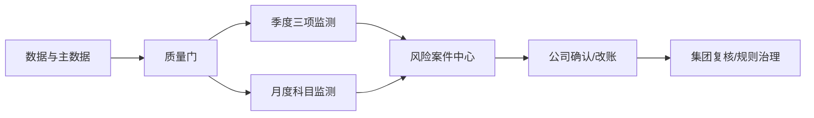

# 1 功能设计说明书

## 1.1 产品版本&密级

- 产品版本：V0.1。
- 文档版本：V0.6。
- 文档密级：集团内部。

## 1.2 拟制信息

- 拟制日期：2026-07-12。
- 上游文档：[总设计](../../superpowers/specs/2026-07-12-group-income-tax-risk-monitoring-platform-design.md)、[架构设计](../architecture/2026-07-12-group-income-tax-risk-monitoring-platform-architecture.md)。

## 1.3 修订记录

| 版本 | 日期 | 内容 |
|---|---|---|
| V0.1 | 2026-07-12 | 功能设计初版 |
| V0.3 | 2026-07-12 | 补齐正式风险建案条件、精确关联与数据字段要求 |
| V0.4 | 2026-07-12 | 与总设计独立评审修订保持一致 |
| V0.5 | 2026-07-12 | 统一IngestBatch接口契约 |
| V0.6 | 2026-07-12 | 第三轮独立规格评审通过 |

## 1.4 Keywords 关键词

季度计提、税负率、潜在调增、业务招待费、福利费、公益性捐赠、风险案件、Agent。

## 1.5 Abstract 摘要

本文定义集团所得税风险监测平台首期功能域、四类监测、数据质量门、人工处置、驾驶舱和管理能力，给出输入、输出、规则、接口、异常及验收要求。

## 1.6 List of abbreviations 缩略语清单

| 缩略语 | 英文全称 | 中文名 |
|---|---|---|
| SAP | Systems, Applications and Products | SAP企业管理系统 |
| OA | Office Automation | 办公自动化系统 |
| Agent | Intelligent Agent | 智能代理 |
| DFX | Design for X | 面向质量属性的设计 |
| FMEA | Failure Mode and Effects Analysis | 失效模式与影响分析 |

## 1.7 前言

功能设计以用户已确认口径为唯一业务基线。规则结果属于内部监测，不替代最终会计和税务结论。

# 2 功能域：集团所得税风险监测

## 2.1 功能域概述

### 2.1.1 功能域总述

本功能域面向集团税务、公司财务、数据管理员和审计人员，把汇算清缴问题前移到月度/季度。核心能力为数据就绪校验、季度确定性计算、月度高召回语义识别、风险案件处置、集团汇总和全链路追溯。



边界：不自动过账、不自动判断税率/亏损、不自动申报、不让Agent直接算税或自动学习。

## 2.2 功能域总体方案

平台按公司×期间建立批次和不可变快照。数据质量门通过后，季度规则引擎和月度专业Agent分别运行并汇入统一风险案件中心；风险由公司处理、集团复核。所有输出附数据、公式、规则和模型版本。

## 2.3 功能域规格设计

| 编号 | 规格 |
|---|---|
| FD-001 | 支持100家以上公司按组织树分层管理和批量运行 |
| FD-002 | 三项季度公式结果与标准底稿一致率100% |
| FD-003 | 月度三类科目输出疑似错入、证据、置信度和改账建议 |
| FD-004 | 缺数、重复、公司不匹配等数据异常不得显示为无风险 |
| FD-005 | 风险、数据、规则、模型和人工操作100%可追溯 |

# 3 功能项：数据准备与监测批次

## 3.1 功能概述

### 3.1.1 功能项总述

面向数据管理员和集团税务，将SAP、合思、OA和线下税务主数据转换为可运行的公司期间快照，并管理月度/季度批次。输入为来源批次及主数据文件，输出为可运行、待补数或失败状态。

## 3.2 实现思路

适配器落原始层，标准化公司、期间、币种、金额符号和源主键；使用记录数、金额控制总额、唯一性和有效期校验。任何关键校验失败只影响对应公司/监测类型。

SAP福利费和公益性捐赠明细必须包含会计期间、过账日期、凭证号、行项目、当前科目和金额。合思业务招待报销应提供SAP参考键/凭证行映射；无法精确关联时进入待关联任务，不进入正式风险清单。

## 3.3 实现设计

### 3.3.1 数据质量与批次功能实现设计

- 税务主数据按公司和有效期唯一。
- 业务招待费清单独立版本化。
- 每个来源记录保留原始主键和提取时间。
- 批次状态：`待取数→校验中→待补数/可运行→运行中→已生成/运行失败`。
- 同一快照和任务键重复提交幂等。

## 3.4 增量SR清单

| SR | 要求 |
|---|---|
| SR-DATA-001 | 主数据缺失或重复拦截率100% |
| SR-DATA-002 | 来源记录数和金额控制总额可查询 |
| SR-DATA-003 | 单家公司可独立补数和重跑 |

## 3.5 实现接口设计

### 3.5.1 实现接口设计

接入适配器统一返回批次元数据、schema版本、记录数、金额总额、源主键和错误码；快照服务向编排器发布就绪状态。

### 3.5.2 实现接口定义

```text
IngestBatch(batch_id, source, extraction_time, period,
            mode, schema_version, payload_ref,
            source_primary_key_definition,
            currency, amount_scale,
            record_count, control_total,
            idempotency_key)
  -> {status, accepted_rows, rejected_rows,
      row_errors[], retryable, ingest_batch_id}

ValidateSnapshot(company, period)
CreateMonitoringBatch(scope, period, monitor_types)
```

`mode`为FULL或INCREMENTAL；`status`为ACCEPTED、PARTIAL或REJECTED。每行携带按主键定义生成的源记录主键；PARTIAL返回逐行错误且默认不得进入可运行状态。

## 3.6 功能规格设计

- 公司无法匹配、税务主数据无有效版本、币种/符号不一致、控制总额不平时进入待补数。
- 数据异常与税务风险分开展示。
- 上传税务主数据须有上传人、复核人、文件校验值和生效期间。

## 3.7 DFX分析

### 3.7.1 可靠性分析

#### 3.7.1.1 FMEA分析

| 失效 | 影响 | 控制 |
|---|---|---|
| 源数据缺失 | 公式失真 | 阻断对应监测，不按0计算 |
| 重复导入 | 风险重复 | 幂等键和源主键唯一约束 |
| 错误主数据版本 | 税额系统性错误 | 有效期、双人复核、版本回放 |

### 3.7.2 可服务性分析

提供来源批次、校验项、错误记录、责任人、重试和控制总额页面。

### 3.7.3 安全设计检查

#### 3.7.3.1 安全设计确认

主数据上传和复核职责分离；文件和接口鉴权；原始数据只读不可改写。

#### 3.7.3.2 敏感操作检查

上传、复核、重跑、删除未发布批次和导出均记录审计日志。

### 3.7.4 可用性/性能分析

按公司并行，单公司失败隔离；数据就绪率和失败公司可从集团看板直接钻取。

## 3.8 影响点列表

SAP、合思、OA需提供稳定主键和控制总额；集团需维护税务主数据和公司清单。

## 3.9 分配需求

分配给接入适配器、快照服务、数据质量服务、编排器和主数据管理模块。

# 4 功能项：季度应计提所得税准确性检查

## 4.1 功能概述

### 4.1.1 功能项总述

面向集团税务和公司财务，对比系统应计提与SAP实际计提。输入为累计利润、SAP收到分红、公允价值变动、可弥补亏损、税率及SAP计提；输出为差异公司和完整公式展开。

## 4.2 实现思路

由确定性规则引擎按SAP账簿精度计算，不允许LLM参与。累计分红取SAP账上本年累计收到分红，排除向股东支付分红；SAP计提只取当期所得税。

## 4.3 实现设计

### 4.3.1 季度计提检查功能实现设计

```text
累计应纳税额
= max（累计利润总额 - SAP累计收到分红
- 累计公允价值变动损益 - 可弥补亏损, 0）× 税率

本季度应计提
= 累计应纳税额 - 以前季度SAP当期所得税计提

计提差异
= 本季度应计提 - 本季度SAP当期所得税计提
```

差异不等于0即示警；正数少计提，负数多计提/需冲回。本季度应计提允许为负。

## 4.4 增量SR清单

| SR | 要求 |
|---|---|
| SR-PROV-001 | 公式与标准底稿一致率100% |
| SR-PROV-002 | 差异不为0全部进入清单 |
| SR-PROV-003 | 每个代入值可追溯到来源字段和版本 |

## 4.5 实现接口设计

### 4.5.1 实现接口设计

规则服务读取同一公司期间快照和有效税务主数据，返回结构化计算结果；案件服务幂等创建或更新风险。

### 4.5.2 实现接口定义

`CalculateProvision(company, quarter, snapshot_id, tax_master_version, rule_version)`返回代入值、累计税额、季度应提、SAP实际、差异和方向。

## 4.6 功能规格设计

输出公司、期间、累计利润、收到分红、公允价值、亏损、税率、累计应纳税额、以前季度计提、本季度应提、本季度实际、差异、方向和所有版本。

## 4.7 DFX分析

### 4.7.1 可靠性分析

#### 4.7.1.1 FMEA分析

科目范围混入递延所得税会系统性误算；通过SAP科目/凭证配置、抽样核对和标准案例阻断。

### 4.7.2 可服务性分析

风险详情显示公式、代入值、数据来源、精度和规则版本。

### 4.7.3 安全设计检查

#### 4.7.3.1 安全设计确认

计算只读访问授权公司快照；公式发布需税务管理员审批。

#### 4.7.3.2 敏感操作检查

规则发布、重跑、导出和关闭风险均审计。

### 4.7.4 可用性/性能分析

100+公司按公司并行；相同快照和规则重跑结果一致。

## 4.8 影响点列表

需建立SAP收到分红、当期所得税计提和公允价值变动的准确科目/字段映射。

## 4.9 分配需求

分配给规则引擎、季度计算Agent、案件服务和风险详情界面。

# 5 功能项：当年累计税负率异常监测

## 5.1 功能概述

### 5.1.1 功能项总述

使用系统累计应纳税额与损益表累计营业收入计算本年税负率，并与线下表前三个完整年度平均税负率比较。

## 5.2 实现思路

复用计提检查的累计应纳税额，不重复计算历史平均。偏离阈值为绝对值达到5个百分点，不是相对变化5%。

## 5.3 实现设计

### 5.3.1 税负率监测功能实现设计

```text
本年累计税负率 = 本年累计应纳税额 / 累计营业收入
偏离度 = 本年累计税负率 - 线下前三完整年度平均税负率
abs（偏离度） >= 0.05 → 示警
```

偏离为正标记偏高，为负标记偏低；恰好±5个百分点也示警。

## 5.4 增量SR清单

| SR | 要求 |
|---|---|
| SR-BURDEN-001 | 不重算线下历史平均税负率 |
| SR-BURDEN-002 | 收入≤0或历史数据缺失转数据异常 |
| SR-BURDEN-003 | 输出偏高/偏低和百分点差异 |

## 5.5 实现接口设计

### 5.5.1 实现接口设计

依赖季度计提结果和有效历史税负主数据；无有效依赖时返回数据异常。

### 5.5.2 实现接口定义

`CalculateTaxBurden(company, quarter, cumulative_tax, cumulative_revenue, historical_rate)`。

## 5.6 功能规格设计

输出公司、本年累计应纳税额、累计营业收入、本年累计税负率、历史平均税负率、偏离度和方向。

## 5.7 DFX分析

### 5.7.1 可靠性分析

#### 5.7.1.1 FMEA分析

分母为0或负数会产生无意义结果；必须阻断并显示数据异常。

### 5.7.2 可服务性分析

详情显示两项税负率来源及“5个百分点”阈值说明。

### 5.7.3 安全设计检查

#### 5.7.3.1 安全设计确认

按公司权限展示，聚合看板不泄露未授权公司明细。

#### 5.7.3.2 敏感操作检查

历史税负主数据上传和修改须双人复核。

### 5.7.4 可用性/性能分析

复用季度结果，计算开销低；批次内向量化处理。

## 5.8 影响点列表

线下表必须使用前三个完整年度平均值并与公司唯一匹配。

## 5.9 分配需求

分配给规则引擎、税务主数据服务、案件服务和驾驶舱。

# 6 功能项：潜在纳税调增税务成本量化

## 6.1 功能概述

### 6.1.1 功能项总述

量化其他应付款暂估余额与合思无票报销金额共同形成的潜在调增及新增所得税成本。

## 6.2 实现思路

两项来源金额均归一化为潜在调增正数后相加；潜在计税基础在原计税基础上加潜在调增。结果仅称“潜在风险估算”。

## 6.3 实现设计

### 6.3.1 潜在税务成本功能实现设计

```text
潜在调增 = 其他应付款暂估余额 + 合思无票报销金额

潜在累计应纳税额
= max（累计利润总额 - SAP累计收到分红
- 累计公允价值变动损益 - 可弥补亏损
+ 潜在调增, 0）× 税率

潜在税务成本 = 潜在累计应纳税额 - 本年累计应纳税额
```

潜在税务成本不等于0时示警。

## 6.4 增量SR清单

| SR | 要求 |
|---|---|
| SR-COST-001 | 潜在调增使用加法 |
| SR-COST-002 | 两项来源按正数风险口径标准化 |
| SR-COST-003 | 不将结果表述为最终纳税调整 |

## 6.5 实现接口设计

### 6.5.1 实现接口设计

规则服务读取暂估余额、合思无票金额和季度计提结果；案件服务只对成本非0结果建案。

### 6.5.2 实现接口定义

`CalculatePotentialTaxCost(company, quarter, accrual_balance, uninvoiced_reimbursement, base_inputs)`。

## 6.6 功能规格设计

输出公司、暂估余额、合思无票金额、潜在调增、潜在累计应纳税额、本年累计应纳税额和潜在税务成本。

## 6.7 DFX分析

### 6.7.1 可靠性分析

#### 6.7.1.1 FMEA分析

金额符号映射错误会反向计算；通过数据字典、正数口径校验和标准样例控制。

### 6.7.2 可服务性分析

详情显示两项来源明细、正数归一化规则和公式展开。

### 6.7.3 安全设计检查

#### 6.7.3.1 安全设计确认

合思明细按公司权限读取，个人字段最小化展示。

#### 6.7.3.2 敏感操作检查

导出无票明细须记录用户、范围、条件和时间。

### 6.7.4 可用性/性能分析

按公司聚合后计算；明细仅在详情按需加载。

## 6.8 影响点列表

SAP暂估余额和合思无票报销需统一公司、期间、币种和金额符号。

## 6.9 分配需求

分配给规则引擎、SAP/合思适配器、案件服务和驾驶舱。

# 7 功能项：月度纳税调增科目入账准确性

## 7.1 功能概述

### 7.1.1 功能项总述

面向公司财务和集团税务，在本年累计明细中高召回识别招待费、福利费和公益性捐赠的疑似错入，输出原文证据、候选科目和改账建议，不自动改账。

## 7.2 实现思路

先由规则引擎确定公司范围，再进行关键词/同义词/排除词/语义相似度宽筛；专业Agent联合SAP、合思和OA证据深判。证据不足只输出待补材料。

## 7.3 实现设计

### 7.3.1 三类专业Agent功能实现设计

| Agent | 公司范围 | 数据 | 主要信号 |
|---|---|---|---|
| 招待费 | 业务招待费公司清单 | 合思招待报销、OA招待申请、自采报销、物料领用 | 内部会议餐、培训餐、员工聚餐、团建、年会、加班餐、食堂、员工福利；会议/培训证据 |
| 福利费 | 累计福利费-累计工资×14%>0 | SAP福利费明细 | 客户/供应商/政府接待、商务宴请；培训/讲师/考试；宣传赠品/客户礼品 |
| 公益捐赠 | 累计捐赠-累计利润×12%>0 | SAP公益性捐赠明细 | 赞助、冠名、广告权益、品牌露出 |

输出标准分类、证据引用、候选科目、理由、置信度和缺失材料。高、中、低候选均保留并排序。

## 7.4 增量SR清单

| SR | 要求 |
|---|---|
| SR-SEM-001 | 试点召回率≥90%，正式上线≥95% |
| SR-SEM-002 | 高置信度准确率≥80% |
| SR-SEM-003 | 已知典型案例不得漏检 |
| SR-SEM-004 | 每项建议有原文或结构化证据引用 |

## 7.5 实现接口设计

### 7.5.1 实现接口设计

范围服务返回公司集合；证据服务返回授权的结构化证据包；专业Agent只接受证据包并返回严格schema；案件服务幂等写入。

### 7.5.2 实现接口定义

`SelectCompanyScope(monitor_type, period)`；`BuildEvidencePack(source_item)`；`ClassifyExpense(agent_type, evidence_pack, rule_version, model_version)`。

## 7.6 功能规格设计

逐条输出公司、期间、凭证/行项目、原科目、金额、原文、关联单据、疑似性质、候选科目、理由、置信度、缺失材料和版本。福利费和捐赠限额以内公司不在首期范围。

正式风险必须精确关联SAP凭证行且分类属于疑似错入。`当前科目合理`只保留检测记录；`证据不足`或只有模糊关联时创建待补材料/待关联任务，不计入风险KPI。

## 7.7 DFX分析

### 7.7.1 可靠性分析

#### 7.7.1.1 FMEA分析

关键词单独定性会误报；采用证据深判。OA关联失败会降低判断质量；标记模糊/缺失并转人工。模型变化可能漂移；版本化和黄金集回放。

### 7.7.2 可服务性分析

提供命中原文、证据关联质量、模型/提示词版本、人工结论和误报/漏报抽样指标。

### 7.7.3 安全设计检查

#### 7.7.3.1 安全设计确认

文本和附件是不可信输入；模型只用白名单工具；公司RLS在数据库和语义索引双层执行。

#### 7.7.3.2 敏感操作检查

修改关键词、规则、提示词或案例库必须审批、回放和记录版本。

### 7.7.4 可用性/性能分析

宽筛降低深判量；按公司并行并对模型调用限流；默认按高风险、金额和证据完整度排序。

## 7.8 影响点列表

需建立跨系统关联键、集团候选科目字典、黄金样本和人工复核资源。

## 7.9 分配需求

分配给范围规则、三个专业Agent、证据服务、建议服务、案件服务和风险详情界面。

# 8 功能项：风险案件、驾驶舱与治理

## 8.1 功能概述

### 8.1.1 功能项总述

统一承接数值和语义风险，支持分派、说明、补材料、改账登记、集团复核、分层看板、导出和规则治理。

## 8.2 实现思路

案件使用稳定指纹去重；每次检测另存版本记录。风险与数据异常分开。集团税务最终关闭，人工结论进入待审样本池而非自动学习。

数值类案件指纹为公司+财年+季度+监测类型；月度明细类指纹为公司+SAP财年+凭证号+行项目+监测类型。规则/模型版本仅进入检测记录，不进入案件指纹。

## 8.3 实现设计

### 8.3.1 案件与治理功能实现设计

- 风险状态：`新发现→待分派→待公司确认`。
- 确认风险：`待改账→已改账待复核→已关闭`。
- 入账合理：填写理由/依据后集团复核关闭。
- 信息不足：补材料后Agent重新判断。
- 驾驶舱：覆盖公司、数据就绪率、异常公司、潜在成本、待处理、逾期及分层钻取。

## 8.4 增量SR清单

| SR | 要求 |
|---|---|
| SR-CASE-001 | 风险到数据和版本可追溯率100% |
| SR-CASE-002 | 重跑不得重复建案 |
| SR-CASE-003 | 公司财务只处理本公司，集团税务最终关闭 |
| SR-CASE-004 | 月度清单在数据就绪后T+2内生成 |

## 8.5 实现接口设计

### 8.5.1 实现接口设计

案件服务通过稳定案件指纹合并；工作流服务校验角色和状态转换；导出服务再次执行权限过滤并记录日志。

### 8.5.2 实现接口定义

`CreateOrUpdateRisk(case_key, detection)`；`TransitionRisk(case_id, action, evidence)`；`ExportRisks(user, filters)`；`PublishRuleVersion(review_id, replay_report)`。

## 8.6 功能规格设计

数值详情显示公式/代入值；语义详情显示原文/证据/候选科目。集团、事业部和公司按组织树查看；数据管理员无税务结论权限；审计只读。

## 8.7 DFX分析

### 8.7.1 可靠性分析

#### 8.7.1.1 FMEA分析

重复案件通过稳定指纹和幂等约束控制；非法状态跳转由状态机拒绝；规则误发布通过双人审批和回滚控制。

### 8.7.2 可服务性分析

提供批次、案件、版本、审计、处理时效、误报率、召回率和模型调用量监控。

### 8.7.3 安全设计检查

#### 8.7.3.1 安全设计确认

RBAC与公司RLS双重控制；导出、规则发布和最终关闭为高敏操作。

#### 8.7.3.2 敏感操作检查

高敏操作需重新鉴权或审批，并完整记录操作者、条件、前后值和时间。

### 8.7.4 可用性/性能分析

列表分页、聚合预计算、详情按需加载；集团看板不直接加载全量凭证明细。

## 8.8 影响点列表

需要组织树、用户角色、责任人、处理时限和更正凭证登记规范。

## 8.9 分配需求

分配给案件服务、工作流、RBAC/RLS、审计、驾驶舱、导出和规则管理模块。
