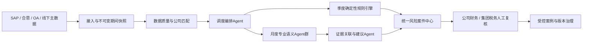

# 集团所得税风险监测平台设计说明书

## 0. 文档信息

| 项目 | 内容 |
|---|---|
| 产品版本 | V0.1（首期设计） |
| 文档版本 | V1.1 |
| 文档密级 | 集团内部 |
| 拟制日期 | 2026-07-12 |
| 拟制方式 | 用户确认口径 + Codex设计 + 独立Agent审视 |
| 文档状态 | 用户终审意见已修订，独立规格评审通过，待用户复核 |

### 0.1 修订记录

| 版本 | 日期 | 修订内容 |
|---|---|---|
| V0.1 | 2026-07-12 | 初版；纳入五个已确认设计章节 |
| V0.2 | 2026-07-12 | 将潜在调增金额修正为“暂估余额 + 合思无票报销金额” |
| V0.3 | 2026-07-12 | 明确累计分红金额为SAP账上本年累计收到分红金额 |
| V0.4 | 2026-07-12 | 根据独立评审补齐源字段、风险指纹、建案条件、接口Schema和舍入契约 |
| V0.5 | 2026-07-12 | 统一接入接口并补充非案件候选幂等键 |
| V0.6 | 2026-07-12 | 第三轮独立规格评审通过 |
| V0.7 | 2026-07-12 | 增加业务招待费无法关联SAP时基于OA/合思直接判断的降级路径 |
| V0.8 | 2026-07-12 | 未关联业务单据双路径修订通过独立规格评审 |
| V0.9 | 2026-07-14 | 明确累计营业收入小于或等于0时本年累计所得税税负率取0 |
| V1.0 | 2026-07-16 | 增加递延所得税计提/转回准确性季度能力 |
| V1.1 | 2026-07-17 | 增加第六项核心能力“所得税退税进度监控及入账科目准确性检查” |

### 0.2 关键词

企业所得税、风险监测、所得税计提、递延所得税、所得税退税、税负率、纳税调增、SAP、合思、OA、Agent、规则引擎、人机协同

### 0.3 摘要

本平台把所得税汇算清缴阶段集中发现的问题前移到月度、季度，形成六项核心能力。季度以确定性公式批量检查100家以上集团公司的所得税计提、递延所得税计提/转回、累计税负率和潜在纳税调增税务成本；月度以专业语义Agent识别业务招待费、福利费和公益性捐赠中的疑似错入明细，并在每年3-12月执行所得税退税进度监控及入账科目准确性检查。平台只生成风险清单、证据和改账建议，不自动改账，也不由大模型计算税额或形成最终税务结论。

## 1. 目标、范围与原则

### 1.1 建设目标

1. 将汇算清缴问题前移到月度、季度，减少年末集中整改。
2. 自动覆盖100家以上公司，降低逐家公司、逐笔凭证人工筛查成本。
3. 提高所得税计提、科目入账和风险说明的准确性。
4. 提前量化潜在纳税调增带来的所得税成本。
5. 形成“发现—解释—确认—改账—复核—优化”的可审计闭环。

### 1.2 首期范围

首期包含：

- SAP、合思、OA和线下税务主数据接入及质量校验。
- 四项季度确定性监测。
- 业务招待费、福利费、公益性捐赠三项月度语义监测。
- 所得税退税进度监控及入账科目准确性检查。
- 集团驾驶舱、风险清单、证据展开、改账建议、人工复核和Excel导出。
- 公司级权限、数据快照、规则/模型版本和全链路审计。

首期不包含：

- 自动生成或过账会计凭证。
- 自动判断适用税率、税收优惠资格或可弥补亏损。
- 发票真伪校验、纳税申报表自动报送。
- Agent未经审核自动修改规则或模型。
- 扩展到全部汇算清缴调整项目。

### 1.3 核心原则

> 数字交给规则，语义交给Agent，最终判断交给人。

- 税额、税负率、阈值、公司范围均由版本化规则引擎处理。
- Agent只用于文本语义理解、跨系统证据归纳和改账方向建议。
- 缺失或异常数据不得按0继续计算，也不得展示为“无风险”。
- 所有结果必须可回到数据快照、公式、规则、模型和人工操作。

## 2. 已确认业务背景与约束

### 2.1 集团与系统现状

- 集团公司数量超过100家。
- 各公司使用统一财务系统和统一会计科目、核算规则。
- 可提供总账、科目余额、会计凭证及摘要，以及固定资产、薪酬、报销、采购等明细。
- 可提供OA业务招待费前置申请以及相关自采报销、物料领用流程。
- 暂不依赖发票数据和纳税申报表数据完成首期功能。

### 2.2 线下税务主数据

线下表按公司和有效期间维护：

| 字段 | 业务口径 |
|---|---|
| 公司编码、名称 | 与SAP公司代码唯一匹配 |
| 适用税率 | 平台只读取，不判断 |
| 递延所得税税率 | 独立公司级税率，平台只读取，不默认等同于适用税率 |
| 可弥补以前年度亏损 | 平台只读取，不重算 |
| 前三年平均税负率 | 前三个完整年度平均值，平台只读取 |
| 有效起止期间 | 控制季度计算采用的版本 |

业务招待费公司清单独立上传并版本化。线下主数据须保留文件名、文件校验值、上传人、复核人、上传时间和生效期间。

### 2.3 关键取数口径

- 累计分红金额：本年1月1日至监测期末，SAP账上记录的公司收到分红金额；排除本公司向股东支付或分配的分红，红字和冲销按SAP符号抵减。
- SAP所得税计提金额：只取当期所得税；排除递延所得税和以前年度所得税调整。
- SAP累计递延所得税费用：按科目余额表 `1811030000`（递延所得税资产-可抵扣亏损）的期末余额原值取数，不做符号翻转；查询成功但目标科目缺失时视为未计提并取0，接口失败或未导入时保持缺数据。
- 公允价值变动损益：保留正负号，公式按代数金额计算。
- 其他应付款暂估余额、合思无票报销金额：归一化为潜在调增正数口径。
- 金额比较精度：使用SAP账簿币种的小数位；不使用二进制浮点数。
- 税率和历史平均税负率：内部统一存储为0至1的小数（例如25%=0.25、9%=0.09）；上传模板可以显示百分号，但导入时必须标准化并校验。5个百分点阈值内部值为0.05。
- 舍入：来源金额保留SAP公司账簿币种精度；中间计算使用十进制定点高精度且不舍入，最终税额按账簿币种小数位采用四舍五入（ROUND_HALF_UP）一次。计提差异在最终税额舍入后判断是否非0；税负偏离在未作展示舍入的高精度比率上与0.05比较。

## 3. 总体架构



### 3.1 分层结构

1. **接入层**：SAP、合思、OA适配器和线下Excel上传。
2. **数据层**：原始数据、标准数据、税务主题数据和不可变期间快照。
3. **规则与Agent层**：确定性公式、范围筛选、专业语义Agent、证据关联和建议生成。
4. **业务层**：监测批次、风险案件、人工复核、改账登记和规则发布。
5. **展示层**：集团驾驶舱、公司清单、风险详情、数据异常和导出。

### 3.2 运行隔离

- 任务粒度为“公司编码 × 会计期间 × 监测类型”。
- 单家公司失败不影响同批其他公司。
- 相同数据快照、规则版本和模型版本重复运行必须得到相同的确定性结果。
- 语义结果保留模型、提示词和案例库版本，支持历史回放与差异比较。

## 4. Agent职责与信任边界

| 角色 | 职责 | 禁止事项 |
|---|---|---|
| 调度编排Agent | 创建月度/季度批次，拆分任务、重试、去重、失败隔离 | 不修改业务结果 |
| 数据质量Agent | 公司匹配、主数据唯一性、期间、币种、符号、完整性、控制总额 | 不推测缺失值 |
| 季度计算Agent | 调用版本化公式并生成代入明细 | 不调用大模型算税 |
| 招待费Agent | 识别招待费疑似错入 | 不作最终会计结论 |
| 福利费Agent | 识别福利费疑似错入 | 不扩大已批准公司范围 |
| 公益捐赠Agent | 识别捐赠疑似赞助/宣传 | 不作最终税务定性 |
| 证据复核Agent | 关联SAP、合思、OA，区分精确和模糊关联 | 不把模糊关联标为确定证据 |
| 改账建议Agent | 输出标准候选科目、理由和缺失材料 | 不生成或过账凭证 |
| 反馈治理 | 汇总人工结论，形成待审样本和版本建议 | 不基于单次反馈自动学习 |

### 4.1 高召回策略

月度监测采用两阶段处理：

1. 宽筛：关键词、同义词、排除词、商户/对象类型及语义相似度共同产生候选。
2. 深判：专业Agent读取授权字段，联合申请、报销、凭证和相关流程证据判断。

所有候选按高、中、低置信度保留并排序。置信度是处理优先级，不等同于统计准确率；正式准确率以人工标注黄金样本校准。

## 5. 数据来源与逻辑接口

### 5.1 来源数据集

| 数据集 | 最低必要字段 |
|---|---|
| SAP损益表累计数据 | 公司、期间、累计营业收入、累计利润总额、累计公允价值变动损益 |
| SAP收到分红 | 公司、过账日期、凭证号、行项目、收到分红金额、冲销标识 |
| SAP所得税计提 | 公司、期间、凭证号、行项目、当期所得税金额、科目、凭证类型 |
| SAP递延所得税累计计提 | 公司、期间、累计递延所得税费用、科目、币种、借贷/冲销标识 |
| SAP其他应付款暂估 | 公司、期间、明细项、余额、币种 |
| SAP费用凭证行 | 公司、财年、会计期间、过账日期、凭证号、行项目、当前科目、金额、币种、分配号/参考键、摘要、冲销标识 |
| 合思无票报销 | 公司、报销单号、期间、金额、报销人、事由 |
| 合思业务招待报销 | 公司、期间、报销单号、金额、摘要、申请事由、关联OA单号、SAP参考键/凭证号/行项目（如源系统具备） |
| OA业务招待申请 | 公司、申请单号、申请人、对象、事由、参与人员、日期 |
| OA自采报销申请 | 公司、申请单号、事项、物品、对象、金额、日期 |
| OA物料领用 | 公司、领用单号、物料、用途、对象、数量、日期 |
| SAP福利费明细 | 公司、会计期间、过账日期、凭证号、行项目、当前科目、金额、摘要、部门、收款方 |
| SAP工资薪金累计 | 公司、期间、累计工资薪金 |
| SAP公益性捐赠明细 | 公司、会计期间、过账日期、凭证号、行项目、当前科目、金额、摘要、收款方 |
| 所得税退税目标清单 | 公司、退税所属年、应退税金额、币种、金额精度、是否已收到退税、来源版本 |
| SAP所得税退税候选凭证明细 | 公司、扫描年/月、凭证号、行项目、过账日期、科目代码/名称、金额、币种、借贷标志、冲销标志 |

业务招待费采用双路径判断。能精确关联SAP凭证行时，以SAP凭证行为主记录，合思/OA作为业务证据；优先使用直接SAP凭证/行项目引用，其次使用SAP分配号或参考字段中的报销单号/申请单号。不能精确关联时，平台不把同公司任意OA或合思单据附到某张SAP凭证，而是以OA业务招待申请单或合思业务招待报销单为主记录，根据申请事由、报销事由、接待对象、参与人员、场景和金额等字段直接判断。OA与合思之间如有精确流程关联，以合思报销单为主记录、OA申请为证据；没有精确关联时分别判断。疑似错入可形成正式风险，标记`SAP关联状态=未关联`和“待定位SAP凭证”；SAP凭证号、行项目和当前科目允许为空。仅凭公司、金额、日期、人员或收款方相似匹配属于模糊关联，不得宣称已找到对应凭证。

未关联业务单据后续找到SAP凭证时，案件服务将其合并到SAP凭证案件，保留原检测、证据和人工处理历史，并以SAP案件作为主案件，避免风险数量和金额重复。无法关联任何前置业务单据的SAP凭证单独列入“SAP未关联凭证清单”，不得借用同公司其他OA/合思记录作判断证据；本次新增的替代判断以OA/合思业务单据为对象。福利费和公益性捐赠仍以SAP凭证行为主记录。

### 5.2 接入契约

每个适配器不论采用API、数据视图或定时文件，都必须提供：

- 批次编号、数据所属期、提取时间、源记录主键定义和每行源主键。
- 记录数、金额控制总额、币种和字段版本。
- 全量/增量标识、账簿金额小数位以及重复提交幂等键。
- 成功、部分成功、失败三类状态；部分成功须返回接收/拒绝记录数和逐行错误；错误码标明是否可重试。

## 6. 六项核心监测能力

### 6.1 季度应计提所得税准确性

```text
本年累计应纳税额
= max（损益表累计利润总额
- SAP账上累计收到分红金额
- 累计公允价值变动损益
- 可弥补以前年度亏损, 0）
× 适用税率

本季度应计提所得税额
= 本年累计应纳税额
- 本年以前季度SAP所得税计提金额

本季度所得税计提差异
= 本季度应计提所得税额
- 本季度SAP所得税计提金额
```

示警条件：按SAP账簿精度比较，差异不等于0。

- 正差异：疑似少计提。
- 负差异：疑似多计提或需要冲回。
- 本季度应计提金额允许为负，不再次取`max`。

输出：差异公司、全部公式代入值、以前季度计提、本季度应计提、本季度实际计提、差异、方向、数据和公式版本。

### 6.2 递延所得税计提/转回准确性

```text
递延所得税计税基础
= 可弥补以前年度亏损 - 损益表累计利润总额

系统累计递延所得税费用
= 递延所得税计税基础 × 递延所得税税率

本年应计提/转回的递延所得税费用
= 系统累计递延所得税费用
- SAP累计已计提的递延所得税费用
```

公式不取`max`或零下限，可弥补以前年度亏损沿用受控主数据中的非负余额含义，并减去损益表累计利润总额。系统累计额和本年调整额按 SAP 账簿币种精度采用`ROUND_HALF_UP`舍入。

示警条件：舍入后的本年应计提/转回额不等于0。正数标记应计提，负数标记应转回，0不建风险。SAP累计额按 `1811030000` 的期末余额原值进入公式。

输出：应计提或转回的公司、本年应计提/转回额、可弥补以前年度亏损、损益表累计利润总额、SAP累计已计提递延所得税费用、系统累计递延所得税费用、递延所得税税率、方向和完整版本血缘。频次为每季度。

生产接入固定校验公司、年度和期间作用域，并只使用 SAP 科目 `1811030000`。合法响应中未找到该科目时生成有来源证据的0；递延所得税税率缺失，或科目余额表接口失败、响应不合法、未导入时阻断本项检查。

### 6.3 当年累计税负率异常

```text
本年累计所得税税负率
= 当损益表累计营业收入 > 0时，
  本年累计应纳税额 / 损益表累计营业收入；
  当损益表累计营业收入 <= 0时，取0

本年累计税负率偏离度
= 本年累计所得税税负率
- 线下表前三个完整年度平均税负率
```

示警条件：`abs（偏离度） >= 5个百分点`。偏离度为正标记偏高，为负标记偏低。营业收入小于或等于0时，本年累计所得税税负率取0，并继续与历史平均税负率计算偏离度和判断是否示警；历史税负率缺失或重复时转数据异常，不计算结果。

输出：异常公司、本年累计税负率、前三年平均税负率、偏离度和方向。

### 6.4 潜在纳税调增税务成本

```text
潜在调增金额
= 其他应付款暂估余额
+ 合思无票报销金额

本年累计潜在应计提所得税额
= max（损益表累计利润总额
- SAP账上累计收到分红金额
- 累计公允价值变动损益
- 可弥补以前年度亏损
+ 潜在调增金额, 0）
× 适用税率

潜在税务成本
= 本年累计潜在应计提所得税额
- 本年累计应纳税额
```

示警条件：潜在税务成本不等于0。

输出：公司、暂估余额、合思无票金额、潜在调增、潜在应计提额、累计应纳税额和潜在税务成本。结果名称必须使用“潜在风险估算”，不能表述为最终纳税调整结论。

### 6.5 月度纳税调增科目入账准确性

#### 6.5.1 业务招待费

- 公司范围：业务招待费公司清单。
- 会计期间：本年1月至本月。
- 数据：合思业务招待报销、OA业务招待申请、OA自采报销申请、OA物料领用。
- 疑似非招待费信号：内部会议餐、培训餐、员工聚餐、团建、年会、加班餐、食堂、员工福利。
- 会议通知、签到、议程支持“会议费”候选；培训班、培训议程、培训对象支持“职工教育经费”候选。
- 判断路径A（已关联SAP）：以SAP凭证行及其关联OA/合思证据综合判断，输出可直接定位的凭证级改账建议。
- 判断路径B（未关联SAP）：独立扫描OA业务招待申请和合思业务招待报销，根据其自身字段直接判断；疑似错入进入正式风险清单，但标记“SAP凭证待定位”，不得把该业务单据当作任意未关联SAP凭证的证据。

#### 6.5.2 福利费

```text
福利费调增额
= 本年累计福利费发生额
- 本年累计工资薪金 × 14%
```

- 只核查福利费调增额大于0的公司。
- 会计期间：本年1月至本月。
- 数据：SAP福利费明细。
- 客户、供应商、政府接待、商务宴请：疑似业务招待费。
- 培训费、讲师费、考试费：疑似职工教育经费。
- 宣传赠品、客户礼品：疑似广告宣传费或业务招待费。

#### 6.5.3 公益性捐赠

```text
公益性捐赠调增额
= 本年累计公益性捐赠发生额
- 损益表累计利润总额 × 12%
```

- 只核查公益性捐赠调增额大于0的公司。
- 会计期间：本年1月至本月。
- 数据：SAP公益性捐赠明细。
- 赞助、冠名、广告权益、品牌露出：疑似赞助支出或广告宣传费。

#### 6.5.4 月度标准输出

每条风险候选至少包含：

- 公司、期间、金额；SAP已关联时还包含凭证号、行项目和当前科目，未关联OA/合思业务单据时这三项允许为空。
- 摘要/申请事由原文和命中文本片段。
- OA、合思、SAP证据引用及精确/模糊关联等级。
- 疑似经济实质、候选科目、建议理由。
- 高/中/低置信度、缺失证据、建议补充材料。
- 规则、案例库、模型和提示词版本。
- 主记录类型（SAP凭证行/OA申请单/合思报销单）、主记录编号、SAP关联状态和风险金额来源。

只有疑似错入的标准分类可以创建正式风险案件。业务招待费即使未关联SAP，只要OA/合思自身字段足以支持疑似错入，也可以建正式风险，并单独统计“已定位凭证/待定位凭证”。`当前科目合理`只保存检测记录，不进入风险清单；`证据不足`创建待补材料任务，不进入风险KPI，如其属于既有风险案件则挂接到原案件并暂停处置。

已知范围边界：福利费和公益性捐赠只检查累计限额已超的公司；限额以内公司的科目错入不在首期范围。

### 6.6 所得税退税进度监控及入账科目准确性检查

每年3-12月按月读取退税所属年 `N` 的应退税公司清单和金额，并扫描 `N+1` 年截至当月的 SAP 候选凭证明细。第一阶段核对所得税费用及其他收益，只有第一阶段零命中时才进入第二阶段核对应交税费；第二阶段只接受 `2221130000`（应交税费-企业所得税）。金额按公司币种精度使用 `ROUND_HALF_UP` 量化，仅比较贷方、未冲销的单条明细，不使用容差或跨行求和。

- 无等额候选：标记未退税，次月继续扫描，不示警、不回写。
- 唯一命中所得税费用：标记已退税且入账科目正确，停止后续扫描，并通过幂等 outbox 回写“已退税”。
- 唯一命中其他收益：标记已退税但入账科目错误，停止后续扫描，回写“已退税”并生成 `REFUND_BOOKED_TO_WRONG_ACCOUNT` 风险。
- 第一阶段零命中且唯一命中应交税费：标记已退税但入账科目错误，停止后续扫描，回写“已退税”并生成同一风险。
- 多个等额候选：列为示警并标记待人工确认，生成风险案例，次月继续扫描且不自动回写。

输出：已退税公司清单、未退税公司清单、所得税退税金额、所得税退税入账科目、匹配阶段、匹配凭证证据和回写状态。飞书“是否已收到退税”已手工填写“已退税”时，导入后直接将平台公司年度目标置为已到账并停止当月及以后扫描；SAP唯一命中也执行同样的停止和回写状态转换。

## 7. 风险案件与人工流程

### 7.1 批次状态

`待取数 → 校验中 → 待补数/可运行 → 运行中 → 已生成/运行失败`

### 7.2 风险状态

`新发现 → 待分派 → 待公司确认`

- 确认风险：`待改账 → 已改账待复核 → 已关闭`。
- 入账合理：填写理由和依据后，`集团复核 → 已关闭`。
- 信息不足：`待补材料 → Agent重新判断 → 人工确认`。
- 业务招待费未关联SAP但已确认风险：`待定位SAP凭证 → 待改账 → 已改账待复核 → 已关闭`。
- 重复事项：合并到主案件，记录重复来源后关闭。

集团税务拥有最终关闭权。平台不自动改账；完成改账后由人员登记更正凭证号。

### 7.3 风险指纹

数值类案件指纹为“公司编码 + 财年 + 季度 + 监测类型”；不同季度不得碰撞。已关联SAP的月度明细案件指纹为“公司编码 + SAP财年 + 凭证号 + 行项目 + 监测类型”。未关联SAP的业务招待费案件指纹为“公司编码 + 财年 + 来源系统 + 业务单据号 + 明细号 + 监测类型”。案件指纹不包含规则或模型版本；每次识别另建检测记录并记录批次、快照、规则、模型和提示词版本。后续建立精确SAP关联时，将业务单据案件合并到SAP案件并保存`merged_into_case_id`；模糊关联不自动合并。

## 8. 产品界面

### 8.1 集团驾驶舱

- 覆盖公司数、数据就绪率、异常公司数、潜在税务成本、待处理数、逾期数。
- 集团—事业部/区域—公司分层钻取。
- 四项季度风险排行、三类月度科目风险分布和处理趋势。
- 风险清单与数据质量异常清单分开展示。
- 业务招待费风险按“已定位SAP凭证/待定位SAP凭证”分开展示；案件合并后只统计SAP主案件，防止风险数量和金额重复。

### 8.2 风险详情

数值类详情显示完整公式、每个代入值、来源字段、取数时间、主数据文件和规则版本。语义类详情显示原文证据、关联单据、疑似经济实质、候选科目、理由、置信度和缺失材料。

## 9. 核心数据模型

| 实体 | 关键内容 |
|---|---|
| Company | 公司与组织树、状态、权限范围 |
| TaxMasterData | 适用税率、递延所得税税率、亏损、历史税负率、有效期间、文件版本 |
| AccountingSnapshot | 公司、期间、来源批次、控制总额、快照校验值 |
| VoucherLine | SAP凭证和行项目、科目、金额、摘要 |
| BusinessDocument | 合思/OA单据、字段、来源主键 |
| EvidenceLink | 两条记录的关联类型、关联键和质量等级 |
| RuleVersion | 公式、阈值、科目范围、关键词、有效期间 |
| ModelVersion | 模型、提示词、案例库、评估报告 |
| MonitoringBatch | 批次范围、状态、开始/结束时间、失败原因 |
| DetectionRecord | 每次计算或Agent判断的快照、版本、结构化输出和计算状态 |
| RiskCase | 风险类型、主记录类型、SAP关联状态、金额及来源、方向、置信度、状态、责任人、合并目标 |
| EvidenceTask | 证据不足的待补材料任务，不计入风险KPI；业务招待费仅“未关联SAP”不再自动降级为EvidenceTask |
| SapLinkCoverage | 无法关联OA/合思的SAP业务招待费凭证覆盖清单，仅反映关联覆盖率，不借用其他业务单据作风险判断 |
| ReviewAction | 人工结论、理由、附件、更正凭证号、操作日志 |

## 10. 权限、安全与隐私

- 集团税务查看全集团并管理规则、复核关闭。
- 事业部/区域只查看授权组织树。
- 公司财务只查看和处理本公司风险。
- 数据管理员维护接口和主数据，不决定税务结论。
- 审计角色只读查看版本、证据和操作轨迹。
- 数据库和语义索引均按公司实施行级权限。
- 姓名、手机号等非必要个人字段脱敏；传给模型的数据最小化。
- 模型使用企业受控端点，业务数据不得用于公共模型训练。
- OA、合思文本和附件均作为不可信输入，不能改变系统指令或工具权限。
- Agent只能调用白名单查询接口，不能自由生成SQL遍历全库。
- 查询、导出、主数据变更、规则发布和风险关闭均留审计日志。

## 11. 异常处理与可靠性

### 11.1 数据异常

以下情况创建数据异常，不输出“无风险”：

- 公司无法匹配。
- 税率、亏损或历史税负率缺失/重复。
- 递延所得税税率或SAP累计递延所得税费用缺失。
- 来源数据未就绪、记录重复或控制总额不平。
- 币种、金额精度或符号口径不一致。
- 业务招待费公司清单缺失或版本无效。

### 11.2 故障恢复

- 可重试接口失败采用有限次数退避重试，超过上限进入异常队列。
- 非重试错误直接通知责任人并保留原始错误上下文。
- 单家公司支持从数据校验或监测步骤独立重跑。
- 风险创建使用幂等键，重跑不得重复建案。

## 12. 测试与验收

### 12.1 确定性公式测试

必须覆盖：零/负利润、负公允价值变动、亏损完全或部分抵扣、当季负数冲回、红字凭证、递延所得税正数计提/负数转回/零差异、亏损加法且不取零、偏离度恰好±5个百分点、营业收入为0或负数时税负率取0并继续判断偏离、主数据缺失和重复。

季度计算结果schema必须显式包含`currency`、`amount_scale`、`calculation_status`（CALCULATED/NOT_CALCULABLE/FAILED）、`alert_flag`、`alert_code`、`not_calculated_reason`以及字段可空定义。未计算值使用空值和原因码，禁止使用0代替；累计营业收入小于或等于0时的税负率0是规则定义的`CALCULATED`结果，不属于缺数或未计算值。

标准计算样例：

- 累计利润总额1,000万元、SAP累计收到分红100万元、公允价值收益50万元、可弥补亏损200万元、税率25%。
- 本年累计应纳税额为`(1,000-100-50-200)×25%=162.5万元`。
- 以前季度SAP计提90万元，本季度实际计提70万元；本季度应计提72.5万元，差异+2.5万元，示警“少计提”。
- 递延所得税税率25%，SAP累计已计提递延所得税费用280万元；系统累计递延所得税费用为`(200-1,000)×25%=-200万元`，本年应转回480万元。
- 累计营业收入5,000万元，本年税负率3.25%；线下历史平均9%，偏离-5.75个百分点，示警“偏低”。
- 其他应付款暂估140万元，合思无票报销30万元，潜在调增170万元；潜在应纳税额`(650+170)×25%=205万元`，潜在税务成本42.5万元。

### 12.2 语义测试

- 由财务、税务人员双人标注并仲裁形成黄金样本。
- 按科目、公司类型和置信度分别统计召回率、准确率和人工复核量。
- 对未被Agent命中的明细进行抽样，避免只评估已命中样本。
- 新规则、新模型上线前运行完整历史回放，并支持一键回滚。

标准语义样例：

- 招待费摘要“内部培训午餐”：疑似职工教育经费或福利费，引用OA申请事由。
- 未关联SAP的OA业务招待申请“部门内部培训午餐”：直接生成“疑似职工教育经费/福利费、SAP凭证待定位”风险；不得关联到同公司任意SAP凭证。
- 福利费摘要“客户商务宴请”：疑似业务招待费。
- 公益捐赠摘要“冠名并获得品牌露出”：疑似赞助或广告宣传，不自动作最终税务定性。

### 12.3 验收指标

| 指标 | 门槛 |
|---|---:|
| 确定性公式与标准底稿一致率 | 100% |
| 结果到原始数据、主数据和版本的可追溯率 | 100% |
| 主数据缺失/重复拦截率 | 100% |
| 100+公司季度批次成功率 | ≥98%，失败公司可单独重跑 |
| 语义识别召回率 | 试点≥90%，正式上线≥95% |
| 高置信度风险准确率 | ≥80% |
| 已知典型案例 | 不得漏检 |
| 月度清单生成时效 | 数据就绪后T+2内 |

## 13. 分阶段上线

1. **阶段1：确定性底座**——主数据、数据质量、季度三项计算、风险案件中心和集团驾驶舱。
2. **阶段2：业务招待费Agent**——打通OA—合思—SAP证据链并建立首批黄金样本。
3. **阶段3：福利费与公益捐赠Agent**——扩展两个专业Agent和建议科目体系。
4. **阶段4：运营优化**——规则版本、历史回放、案例库、指标和模型漂移监控。
5. **阶段5：递延所得税扩展**——新增独立递延所得税税率、SAP累计计提指标、季度第四项确定性计算和公式展示；历史`QUARTERLY_V1`继续按三项回放，新规则版本运行四项。

## 14. 主要风险与控制

| 风险 | 控制措施 |
|---|---|
| SAP科目或符号口径错误导致系统性误算 | 数据字典、控制总额、标准样例和双人确认 |
| OA、合思、SAP无法稳定关联 | 精确/模糊关联分级；证据不足降级人工 |
| 高召回导致人工负担过大 | 按置信度和金额排序；监控每千条风险量和复核时长 |
| Agent把关键词当作最终结论 | 必须联合证据，输出“疑似”和候选方向 |
| 模型或规则漂移 | 版本化、黄金集回放、审批发布和回滚 |
| 限额内福利费/捐赠错入被漏掉 | 明确为首期范围边界；后续可通过全量抽样评估是否扩围 |
| 无票事项被误表述为确定纳税调整 | 只称“潜在风险估算”，保留人工和凭证真实性判断 |

## 15. 实施规划输入

本设计已经给出完整业务规则、数据契约、Agent边界、流程状态、异常策略和验收口径。实施计划需按五个上线阶段进一步拆分接口适配、数据建模、规则开发、Agent评估、前端工作流和上线迁移任务。具体模型供应商、部署形态及每个源系统采用API或批量文件，属于实施层适配选择，但必须满足本设计的数据最小化、企业受控端点、幂等和审计要求。

## 16. 参考资料

1. [中华人民共和国企业所得税法实施条例](https://www.chinatax.gov.cn/n810341/n810765/n812176/n812748/c1193046/content.html)
2. [中华人民共和国企业所得税法](https://12366.chinatax.gov.cn/bzds/024/024-5-1.html)
3. [国家税务总局关于发布《企业所得税税前扣除凭证管理办法》的公告](https://fgk.chinatax.gov.cn/zcfgk/c100012/c5194804/content.html)

> 本设计中的季度/月度监测公式和示警阈值以集团已确认管理口径为准。平台输出用于内部风险监测，不替代最终会计判断、纳税申报或税务机关结论。
